# F18 Fighter Simulation（ammojs）技术分析全文档

> 生成时间：2026-05-09  
> 分析范围：`src/` 下 15 个 TS 文件 + 资源目录  
> 技术栈：Babylon.js 5.0-alpha + Ammo.js + TypeScript + Webpack  
> 目标读者：**从零学习如何实现这类 3D 战机飞行模拟游戏**

---

## 阅读指南

| 章节 | 回答的问题 | 推荐阅读顺序 |
|------|-----------|------------|
| Doc1 项目概览 | 这是什么？用什么做的？为什么这样选？ | 1 |
| Doc2 系统架构 | 整个程序怎么组装起来？各模块谁依赖谁？ | 2 |
| Doc3 数据流向 | 一次按键如何最终推动飞机？数据流向长什么样？ | 3 |
| Doc4 交互逻辑 | 用户可见的状态机（起飞→飞行→爆炸）是什么？ | 4 |
| Doc5 组件关系 | 每个文件到底负责什么？相互调用关系？ | 5 |
| Doc6 学习路径 | 我想从 0 写一个，应该先学什么？分几步？ | 6 |

---

# Doc1 · 项目概览与技术选型

## 1.1 项目一句话描述

这是一款运行在浏览器中的 **F18 战斗机飞行模拟器**，具备完整的飞控物理（俯仰/翻滚/偏航/升力/阻力/推力）、HUD 抬头显示、第一/第三人称/目标视角切换、键盘与 Xbox/PS4 手柄输入、3D 空间音效、机体复合体碰撞、爆炸解体、骨骼驱动的气动舵面（副翼/方向舵/升降舵/起落架）、资源 LOD 优化、尾流拖尾等。

> ⚡ 核心洞察：作者没有用「飞机专用物理」，而是**复用了 Ammo.js 的车辆载具类 `btRaycastVehicle`**（本来给汽车用的），用 4 个轮子 + 4 个包围盒复合体拼出飞机的物理体，然后通过手动 `applyForce` + `setAngularVelocity` 模拟升力、推力、俯仰/翻滚/偏航力矩。这是整个项目最关键、也是最聪明的取舍。

## 1.2 技术栈清单

| 层 | 选择 | 版本 | 作用 |
|----|------|------|------|
| 渲染引擎 | `@babylonjs/core` | 5.0.0-alpha.65 | 3D 渲染、相机、灯光、阴影、粒子、Sprite、TrailMesh、雾、天空球 |
| UI 覆盖层 | `@babylonjs/gui` / `babylonjs-gui` | 5.0.0-alpha.65 | HUD 面板（AdvancedDynamicTexture + XmlLoader） |
| 模型加载 | `babylonjs-loaders` | 5.0.0-alpha.65 | `.glb` 模型解析（GLTFFileLoader） |
| 物理引擎 | `ammo.js`（CDN 外链） | — | 刚体、`btRaycastVehicle`、复合形状、MeshImpostor |
| 语言 | TypeScript | 4.2 | ES6 target，`noImplicitAny: false`（宽松模式） |
| 构建 | Webpack 5 | 5.24 | `ts-loader` + `HtmlWebpackPlugin` + `CopyWebpackPlugin`（把 `src/assets` 拷到 `dist/assets`） |
| 辅助库 | `dat.gui` / `rxjs` / `lodash` / `cannon` / `oimo` | — | 大多未使用，属于模板残留（见下方风险点） |

## 1.3 选型理由与关键取舍

1. **Babylon.js 而非 Three.js**：Babylon 内置 `PhysicsImpostor` 抽象层 + `AmmoJSPlugin`，可直接 `scene.enablePhysics(gravity, new AmmoJSPlugin(true, Ammo))` 启用物理；同时自带 GUI、粒子、Sprite、TrailMesh、XmlLoader 等「游戏成品」级 API，省去大量自研。
2. **Ammo.js 而非 Cannon/Oimo**：`package.json` 里同时列了 cannon 和 oimo，但代码里**只用 Ammo**（`AmmoJSPlugin`）。原因：Ammo 提供 `btRaycastVehicle`，天然适合模拟带轮子的载具；而飞机起飞前本来就要滑跑，复用车辆物理最省事。
3. **Ammo 通过 CDN + 全局 `window.Ammo()` 异步加载**：见 `src/index.ejs` 第 14 行 `<script src="//cdn.xidayun.com/ammo.js">` 和 `src/index.ts` 里 `await window["Ammo"]()`。这避免了 webpack 打包 Ammo 这种 1MB+ 的 wasm 封装文件的麻烦。
4. **模型走 `.glb` + `AssetContainer`**：`F18Assets.loadFly` 使用 `BABYLON.SceneLoader.LoadAssetContainer` 把 F18 和爆炸版本分别加载成两个 `AssetContainer`，再用 `instantiateModelsToScene()` 实例化（支持多架飞机共享资源，见 `f18Physics.ts` 构造函数）。

## 1.4 资源组织

```
src/assets/
├── mesh/        # glb 模型：飞机本体、爆炸碎片版本、地图
├── texture/     # 天空盒 skybox6/、水面波纹、地面、爆炸贴图
├── sound/       # f18.mp3 引擎声、boom.mp3 爆炸声
├── video/       # rain4.mp4 用作飞机玻璃的雨滴折射纹理
├── gui/         # hud_speed.xml HUD 布局 + 箭头 PNG + speed 面板 PSD
└── image/tu.png # 键位说明图
```

> ❓ 待确认：`cannon`、`oimo`、`rxjs`、`lodash`、`@types/es6-shim` 在源码中**全部未被 import**，属于 package.json 冗余依赖。可在清理时删除。

## 1.5 风险点速览（详见 Doc6）

- ⚠️ `src/index.ejs` 外链 `cdn.xidayun.com/ammo.js` —— CDN 不可控，若域名失效项目直接无法启动。
- ⚠️ 使用的是 Babylon **5.0.0-alpha.65**（非稳定版），升级到正式版会有 API 破坏。
- ⚠️ `F18Physics.render()` 中 yaw 力同时被 push 进正向和反向（84-99 行），出现**互相抵消的逻辑**，疑似历史代码未清理。

---

# Doc2 · 系统架构设计

## 2.1 三层结构

整个系统可抽象成 3 层：

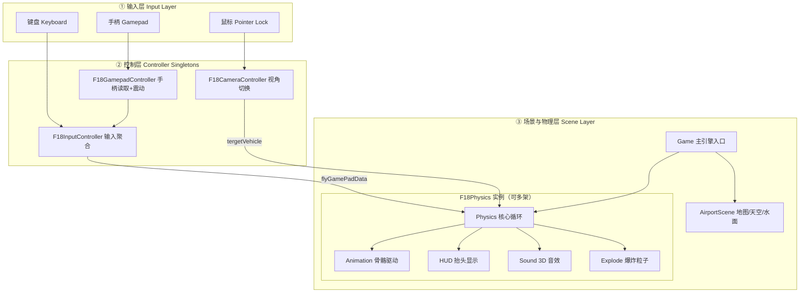

## 2.2 模块职责表

| 模块 | 文件 | 职责 | 是否单例 |
|------|------|------|---------|
| `Game` | `src/game.ts` | 引擎/场景创建、物理开关、飞机实例管理、UI 按钮 | 否 |
| `F18Assets` | `src/vehicleObject/f18/f18Assets.ts` | 加载 glb 资源到 `AssetContainer`，处理玻璃/火柱材质 | 否（但整个 app 只实例化一次） |
| `F18Physics` | `src/vehicleObject/f18/f18Physics.ts` | **核心**。创建 `btRaycastVehicle`、每帧施加推力/升力/阻力/力矩、更新车轮位置、HUD 姿态数据 | 否（每架飞机一个） |
| `F18Animation` | `f18Animation.ts` | 驱动副翼/方向舵/升降舵/起落架骨骼，信号灯闪烁，尾焰缩放 | 否 |
| `F18HUD` | `f18HUD.ts` | 用 Babylon GUI 在 3D 平面上渲染俯仰/偏航刻度条、前向指示、速度面板 | 否 |
| `F18SoundController` | `f18Sound.ts` | 引擎声 loop、爆炸声、手柄震动、视角音量衰减 | 否 |
| `F18Explode` | `f18Explode.ts` | 遍历爆炸模型子网格，为每块创建 box 刚体 + 粒子烟雾 | 否 |
| `F18InputController` | `f18InputController.ts` | 键盘事件 → `flyGamePadData` 标准化 | **单例 ins** |
| `F18GamepadController` | `f18GamePadController.ts` | 轮询 `navigator.getGamepads()` → 同样写入 `flyGamePadData` | **单例 ins** |
| `F18CameraController` | `f18CameraController.ts` | tps/fps/target 三相机切换、鼠标 pointerLock 旋转 | **单例 ins** |
| `F18LODManager` | `f18LODManager.ts` | 根据 mesh 名里的 `LOD_DO_1~5` 后缀添加 LOD 距离层级 | **单例 ins** |
| `AirportScene` | `src/physicsScene/airportScene.ts` | 加载地图 glb、天空球、雾、水面 uOffset 动画、发射位点 | 否 |

## 2.3 启动时序

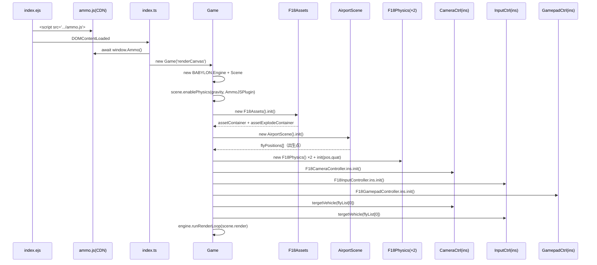

## 2.4 关键设计模式

- **单例模式**（InputController/GamepadController/CameraController/LODManager）：因为整个场景只有一个鼠标/键盘/当前相机，用 `static ins` 保证全局唯一。
- **目标切换模式**（`tergetVehicle()`）：三个单例都有 `tergetVehicle(vehicle: F18Physics)` 方法，支持运行时切换被驾驶/观察的飞机，无需销毁重建。
- **帧循环订阅**（`scene.onBeforeRenderObservable.add`）：几乎每个模块（Physics/Animation/CameraCtrl/InputCtrl/AirportScene）都注册自己的 `render()` 回调到这个事件上，统一由 Babylon 的 RAF 驱动。
- **复合刚体**（`btCompoundShape` + 多个 `btBoxShape`）：机身+两翼+尾翼+垂尾共 4 个 Box 拼成飞机的碰撞体（`F18Physics.addCompound`）。


---

# Doc3 · 数据流向与核心数据结构

## 3.1 核心数据结构

### 3.1.1 `FlyInputData`（原始输入状态）

定义：`src/interface/fly.ts`

```typescript
interface FlyInputData {
    pitchUp: boolean;    // 俯仰抬头
    pitchDown: boolean;  // 俯仰低头
    rollLeft: boolean;   // 翻滚左
    rollRight: boolean;  // 翻滚右
    yawLeft: boolean;    // 偏航左
    yawRight: boolean;   // 偏航右
    accelerate: boolean; // 油门
    brake: boolean;      // 刹车
}
```

这是**键盘层的布尔标志**。由 `F18InputController.flyInputData` 持有，每帧被 `updatePitchNumber()` 等方法转换成数值。

### 3.1.2 `flyGamePadData`（归一化控制信号）

定义：`F18Physics` 内的 public 属性

```typescript
public flyGamePadData = {
    pitchNumber: 0,        // [-1, 1]
    rollNumber: 0,         // [-1, 1]
    yawNumber: 0,          // [-1, 1]
    accelerateNumber: 0,   // [0, 1000]
    brakeNumber: 0,        // 0 or 1
    switchCameraNumber: 0,       // 未使用
    switchUndercarriageNumber: 0 // 未使用
}
```

> ⚡ 核心洞察：`flyGamePadData` 是整个项目的「**数据总线**」。无论输入来自键盘还是手柄，最终都归一化到同一个对象，物理层只关心这个对象。这是典型的「输入解耦」设计。

### 3.1.3 `FlyData`（物理运行时输出）

```typescript
interface FlyData {
    accelerateSize: number;  // 实际推力（= accelerateNumber）
    resistance: number;      // 空气阻力系数（随速度分段）
    flySpeed: number;        // km/h，来自 vehicle.getCurrentSpeedKmHour()
    flyLift: number;         // 升力 N（随速度分段）
}
```

这是每帧由 `F18Physics.render()` 计算后写入的结果，被 HUD、音效、动画等消费。

### 3.1.4 三种相机视角枚举

`F18CameraController.flyViews = ["tps", "fps", "target"]`  
- `tps`：第三人称（屁股后面跟拍，`tpsFlyCamera`）
- `fps`：第一人称（座舱内，`fpsFlyCamera`，会显示 HUD）
- `target`：目标锁定（`ArcRotateCamera`，可手动绕机身旋转）

## 3.2 主数据流（一次按下 W 键发生了什么）

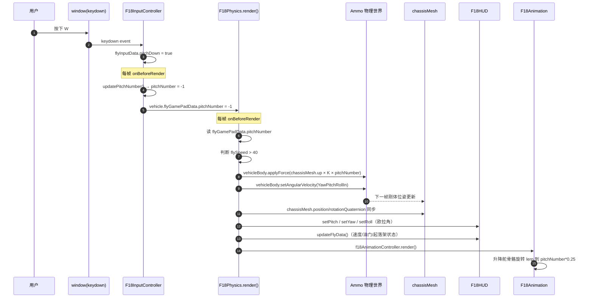

## 3.3 数据流全景图

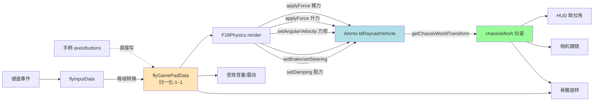

## 3.4 飞机物理计算模型（重点！）

这是学习本项目最需要深入理解的部分。`F18Physics.render()` 中的物理公式：

### 3.4.1 推力（Thrust）

```typescript
let _speed2 = 18 * this.flyData.accelerateSize;  // accelerateSize ∈ [0, 1000]
this.vehicleBody.applyForce(
    new Ammo.btVector3(
        -chassisMesh.forward.x * _speed2 * fpsDt,
        -chassisMesh.forward.y * _speed2 * fpsDt,
        -chassisMesh.forward.z * _speed2 * fpsDt
    ),
    new Ammo.btVector3(0, 0, 0)  // 作用点：质心
);
```

> ⚡ 沿机头 `-forward` 方向施加力，因为 glb 模型导入后机头朝 `-Z`。`fpsDt = scene.getAnimationRatio()` 用于保证不同帧率下物理量一致。

### 3.4.2 升力（Lift）—— 分段函数

```typescript
if (flySpeed > 300)        flyLift = 2000;
else if (flySpeed > 150)   flyLift = 500;
else                       flyLift = flySpeed;  // 低速时升力 = 速度值

vehicleBody.applyForce(new Ammo.btVector3(0, flyLift * fpsDt, 0), ...);
```

> ⚠️ **非真实物理**：真实升力 L = ½ρv²SCL（与速度平方成正比）。这里用分段常数是为了游戏手感 —— 既保证起飞门槛（低速掉落），又防止高速暴冲进太空。

### 3.4.3 阻力（Drag）—— 用 damping 模拟

```typescript
if (flySpeed > 300)        resistance = 0.7;
else if (flySpeed > 150)   resistance = 0.5;
else                       resistance = 0.2;
vehicleBody.setDamping(resistance, 0);  // 线阻尼，角阻尼=0
```

### 3.4.4 俯仰/偏航/翻滚 —— 角速度 Lerp 混合

```typescript
// 1) 收集目标角速度（仅当速度足够）
if (flySpeed > 40)  YawPitchRollIn.x = -2 * pitchNumber;
if (flySpeed > 10)  YawPitchRollIn.y =  0.8 * yawNumber;  // 这里同时被 ±0.8 推两次，见风险点
if (flySpeed > 40)  YawPitchRollIn.z =  4 * rollNumber;

// 2) 乘上加速度系数
YawPitchRollIn *= stats.angularAcceleration;  // (π·0.3, π·0.3, π·0.3)

// 3) 从局部坐标转换到世界坐标
YawPitchRollIn = Vector3.TransformCoordinates(YawPitchRollIn, rotMatrix);

// 4) 与当前角速度插值 + 应用衰减
newYPR = Lerp(currentAngularVel, YawPitchRollIn, 0.05·fpsDt)
newYPR *= stats.angularDeceleration;  // (0.95, 0.95, 0.95)
vehicleBody.setAngularVelocity(newYPR);
```

> ⚡ 核心洞察：**没有施加力矩**（`applyTorque`），而是**直接覆盖刚体的角速度**。这让操纵感更「直接」、更像街机，但也失去了真实物理里的惯性表现（大迎角甩尾、死亡螺旋等）。

### 3.4.5 气动辅助力（奇怪的设计）

`flyGamePadData.pitchNumber` 和 `yawNumber` 除了改角速度，还额外施加了推进力（`chassisMesh.up` / `chassisMesh.right` 方向）。这不符合真实气动，推测是为了**强化转向感**（比如低头时机头真的会往下栽，而不是原地转头）。

## 3.5 资源加载数据流

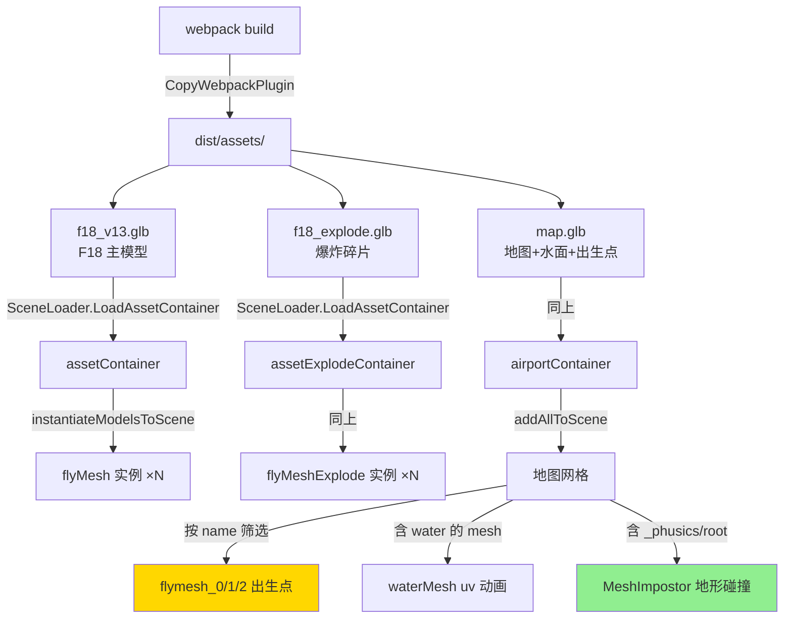

> ⚡ 核心洞察：**约定优于配置** —— 出生点、水面、地形碰撞全靠 mesh **命名前缀/关键字**识别（`flymesh_`、`water`、`_phusics`、`root`）。修改模型命名会直接破坏游戏逻辑。


---

# Doc4 · 交互逻辑与用户流程

## 4.1 用户旅程

```mermaid
graph LR
    Start([打开页面]) --> Load[LoadingUI 加载资源]
    Load --> Idle[主界面<br/>面板可见<br/>鼠标未锁]
    Idle -->|点 Continue| Locked[鼠标锁定<br/>进入驾驶]
    Locked -->|W/S 俯仰<br/>A/D 翻滚<br/>Q/E 偏航<br/>Shift 加速| Flying[飞行中]
    Flying -->|按 V| SwitchCam[切换视角 tps→fps→target]
    SwitchCam --> Flying
    Flying -->|按 R| Gear[切换起落架]
    Gear --> Flying
    Flying -->|ESC| Idle
    Idle -->|点"添加战斗机"| AddFly[新增 F18 到出生点]
    Idle -->|点"驾驶"某架| Switch[切换驾驶目标]
    Idle -->|点"爆炸"| Boom[解体+粒子+音效]
    Idle -->|点"销毁"| Dispose[清理实例]
    Idle -->|点"暂停/恢复"| Pause[冻结物理]
    Idle -->|点"重置场景"| Reset[重载地图]
```

## 4.2 键位与手柄映射

| 动作 | 键盘 | 手柄按钮（标准布局） | 代码位置 |
|------|------|--------------------|---------|
| 俯仰低头 | `W` | 右摇杆 axis[3] 负 | `f18InputController.ts` keyToAction |
| 俯仰抬头 | `S` | 右摇杆 axis[3] 正 | 同上 |
| 翻滚左 | `A` | 右摇杆 axis[2] 负 | 同上 |
| 翻滚右 | `D` | 右摇杆 axis[2] 正 | 同上 |
| 偏航左 | `Q` | LT `buttons[6]` | 同上 |
| 偏航右 | `E` | RT `buttons[7]` | 同上 |
| 加速（油门） | `Shift` | Dpad↑ `buttons[12]` | 同上 |
| 刹车（减油门） | `Space` | Dpad↓ `buttons[13]` | 同上 |
| 切换视角 | `V` | B `buttons[1]` | `cameraChange()` |
| 起落架 | `R` | Y `buttons[3]` | `undercarriageChange()` |
| 环视（fps）/绕机（target） | 鼠标移动 | 左摇杆 axes[0][1] | `rotate3D` / `updateFpsCameraRotation` |
| 震动反馈 | — | 自动（与油门联动） | `f18Sound.ts` |

## 4.3 输入优先级机制

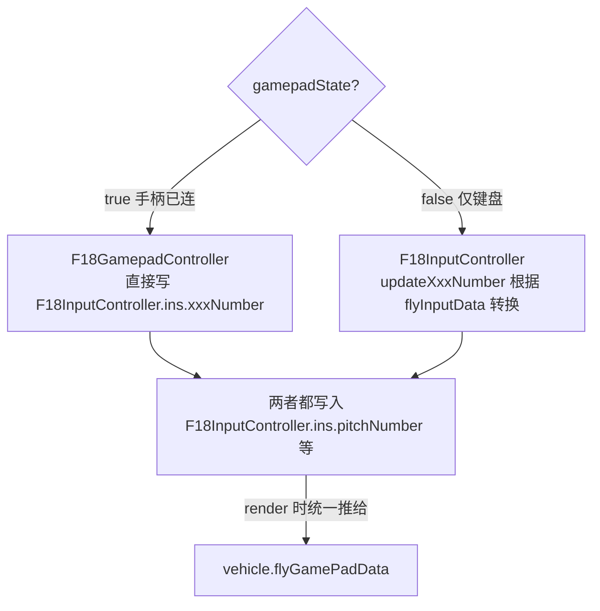

> ⚡ 核心洞察：手柄插入后，键盘输入**被跳过**（`if(!this.gamePadState){ updateXxx }`），避免同时操作冲突。

## 4.4 起落架状态机

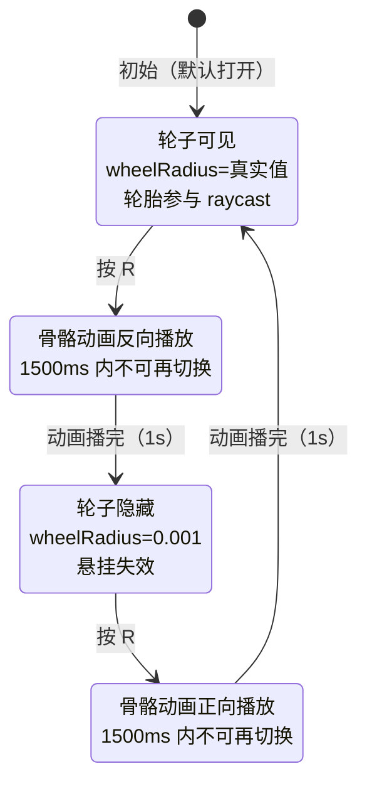

关键实现：`F18Animation.undercarriageChange()` + `F18Physics.render()` 根据 `undercarriageState` 动态改 `vehicle.getWheelInfo(i).set_m_wheelsRadius()`。

## 4.5 爆炸流程

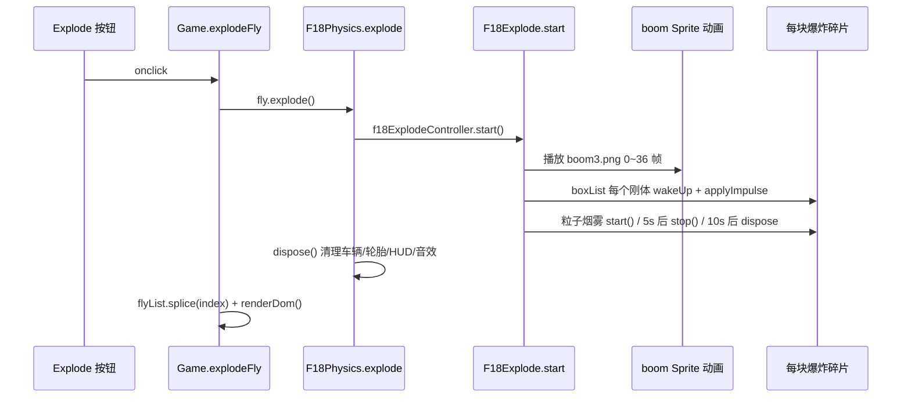

## 4.6 视角切换时的 HUD 显隐

```typescript
// f18CameraController.render()
if (view == "tps")    vehicle.showHud = false;   // 第三人称不显示
else if (view == "fps") vehicle.showHud = true;  // 座舱内显示
else if (view == "target") vehicle.showHud = false;
```

`F18HUD.setShow(state)` 通过把 `hudGround.scaling` 置零/还原实现隐藏，避免重建网格。

---

# Doc5 · 组件关系与代码结构

## 5.1 带注释的目录树

```
fly/
├── src/
│   ├── index.ts                    ← 入口，等待 Ammo().then → new Game
│   ├── game.ts                     ← 主控制器：引擎/场景/飞机列表/UI按钮
│   ├── index.ejs                   ← HTML 模板（含 Ammo CDN <script>）
│   ├── ammo.d.ts                   ← Ammo.js TypeScript 类型提示
│   │
│   ├── base/
│   │   ├── config.ts               ← 全局资源 URL 前缀（读 window.assetsUrl）
│   │   └── funt.ts                 ← 工具函数：getDistance、autoLOD
│   │
│   ├── interface/
│   │   └── fly.ts                  ← FlyData / FlyInputData 类型定义（全局声明）
│   │
│   ├── physicsScene/
│   │   └── airportScene.ts         ← 地图场景：天空球/雾/glb 加载/水面动画/出生点
│   │
│   └── vehicleObject/f18/
│       ├── f18Assets.ts            ← glb 资源加载 + 玻璃雨滴视频贴图处理
│       ├── f18Physics.ts   ★核心   ← btRaycastVehicle + 力/力矩/升力/阻力/复合体
│       ├── f18Animation.ts ★关键   ← 骨骼驱动：副翼/方向舵/升降舵/起落架/尾焰/信号灯
│       ├── f18HUD.ts               ← 3D 平面 HUD：俯仰条/偏航条/速度面板/前向标
│       ├── f18Sound.ts             ← 引擎 loop 声 + 爆炸声 + 手柄震动 + 视角衰减
│       ├── f18Explode.ts           ← 爆炸解体：每块子 mesh 变 box 刚体 + 粒子烟雾
│       ├── f18InputController.ts   ← 单例：键盘 → flyGamePadData
│       ├── f18GamePadController.ts ← 单例：手柄 → flyGamePadData + 震动
│       ├── f18CameraController.ts  ← 单例：tps/fps/target 三相机 + pointerLock
│       ├── f18LODManager.ts        ← 单例：按 mesh 名后缀自动设置 LOD 距离
│       └── f18Global.ts            ← 全局灯光闪烁 interval 缓存（跨实例共享）
│
├── src/assets/                     ← 被 CopyWebpackPlugin 拷贝到 dist/assets
├── f18/                            ← Blender 源文件（骨骼绑定）
├── map/                            ← Blender 源文件（机场地图）
├── screenshot/                     ← README 用截图
├── package.json
├── webpack.config.js               ← 开发/打包配置
├── tsconfig.json                   ← ES6 target，宽松模式
└── README.md / README.en.md
```

## 5.2 组件依赖图

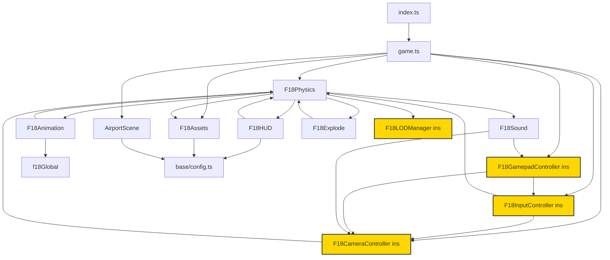

> ⚠️ **循环依赖风险**：`FP ↔ FAn`、`IC ↔ CC ↔ FP` 之间是双向引用（Animation 需要读 Physics 的 `flyGamePadData`，Physics 又要调 Animation 的 render）。Webpack 的 ESM 循环 import 被容忍是因为都通过运行时引用（不是顶层代码执行）。

## 5.3 职责 vs 实现热点

| 组件 | 代码行数 | 复杂度 | 学习顺序建议 |
|------|--------|-------|------------|
| f18Physics | ~400 | ⭐⭐⭐⭐⭐ 最高 | **最后学**，先理解前序 |
| f18Animation | ~350 | ⭐⭐⭐⭐ | 需要 Blender 骨骼基础 |
| f18HUD | ~260 | ⭐⭐⭐ | 学 Babylon GUI 基础后 |
| f18Explode | ~180 | ⭐⭐ | 粒子+刚体入门 |
| airportScene | ~120 | ⭐⭐ | 入门第二个看 |
| game | ~200 | ⭐⭐ | 入门第一个看 |
| 三个 Controller 单例 | 各 ~150 | ⭐⭐ | 先看 Input，再看 Camera，再看 Gamepad |
| f18Assets | ~70 | ⭐ | 第一个看 |
| f18Sound / f18LODManager | <100 | ⭐ | 最简单 |

## 5.4 "约定即契约"清单

这些字符串硬编码在代码里，**改模型时一个字都不能错**：

| 来源 | 约定字符串 | 用途 |
|------|----------|------|
| `map.glb` mesh 名 | `flymesh_0`、`flymesh_1`... | 飞机出生点 |
| 同上 | 包含 `water` | 水面 uv 动画 |
| 同上 | 包含 `_phusics`（拼写错误，原文如此）或 `root` | 物理碰撞体 |
| `f18_v13.glb` 骨骼名 | `k4_qlik`、`后轮液压左/右` | 起落架 IK |
| 同上 | `副翼左/右`、`方向舵左/右`、`升降舵` | 气动舵面 |
| 同上 mesh 名 | 含 `LOD_DO_1~5` 后缀 | LOD 距离分级 |
| 同上 | 含 `boli`/`0853` | 玻璃材质（视频折射） |
| 同上 | 含 `火柱` | 尾焰材质 |
| 同上 | 含 `Mesh_0869.001`、`Mesh_0860_LOD_DO_5` | 信号灯闪烁 |

> ⚡ 核心洞察：这类项目的**真正数据契约不在代码里，在 Blender 文件里**。重做模型时要先建立命名规范文档。

## 5.5 一帧的完整调用顺序

按 `scene.onBeforeRenderObservable` 订阅顺序：

```
Frame N begin
 ├─ 1. AirportScene.render()
 │     └─ waterMesh.material.bumpTexture.uOffset += 0.001（水波）
 ├─ 2. F18Physics.render()（每架飞机一次）
 │     ├─ 读取 flyGamePadData
 │     ├─ 计算并 applyForce（推力/升力）
 │     ├─ setDamping（阻力）
 │     ├─ setAngularVelocity（俯仰翻滚偏航）
 │     ├─ setBrake / setSteering
 │     ├─ set_m_wheelsRadius（起落架）
 │     ├─ 同步 wheelMeshes 位姿
 │     ├─ 同步 chassisMesh 位姿
 │     ├─ f18AnimationController.render()
 │     │     ├─ updateUndercarriage（起落架骨骼）
 │     │     ├─ updateWheel（轮胎克隆网格）
 │     │     ├─ updateAilerons / updateRudders / updateElevators（气动舵面）
 │     │     └─ updateFlames（尾焰缩放）
 │     ├─ f18SoundController.render()（音量/震动）
 │     └─ f18HUDController.updateFlyData() + setShow()
 ├─ 3. F18InputController.render()（键盘归一化）
 ├─ 4. F18GamepadController.render()（手柄轮询）
 └─ 5. F18CameraController.render()（相机跟随 lerp + HUD 显隐）
Frame N → engine.runRenderLoop → scene.render() 实际绘制
```


---

# Doc6 · 从 0 开始学习这个项目的路径

> 本章针对你的目标：**从 0 学习做这种游戏**，而不是给维护者的重构建议。  
> 如果你已经把 Doc1~Doc5 过了一遍，这里给你一个可执行的学习计划。

## 6.1 前置知识地图

在动手 clone 代码前，你应该先掌握以下概念（从易到难）：

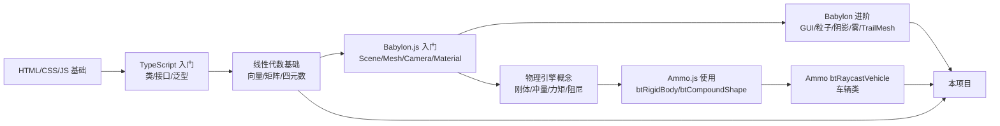

### 必学概念清单

| 概念 | 为什么重要 | 学习资源 |
|------|-----------|---------|
| **四元数 vs 欧拉角** | HUD 姿态显示、相机 Slerp 都在用 | 3Blue1Brown 四元数可视化 |
| **局部坐标 vs 世界坐标** | `chassisMesh.forward` / `up` / `right` 是局部方向向量 | Babylon 官方 Transforms 章节 |
| **刚体（Rigid Body）** | `vehicleBody`、爆炸碎片都是 | Ammo 文档 + 任意物理教程 |
| **复合形状（Compound Shape）** | 飞机不是简单立方体，要用 4 个 box 拼 | 本项目 `addCompound()` 为最佳教材 |
| **btRaycastVehicle** | 本项目的物理骨架 | Bullet3 官方示例 `VehicleDemo` |
| **Lerp / Slerp** | 所有动画/相机平滑都用它 | Babylon Scalar/Vector3/Quaternion 文档 |
| **RAF 帧循环 / delta time** | `scene.getAnimationRatio()` 的意义 | MDN requestAnimationFrame |

## 6.2 推荐学习路径（5 个阶段）

### 阶段 1：跑起来 + 玩熟（0.5 天）

```bash
npm install
npm start
# 浏览器打开 http://localhost:8080
```

任务：
1. 用键盘试完所有动作，确认 Doc4 的键位表无误
2. 连一个 Xbox 手柄试试（可选）
3. 打开 DevTools 看控制台输出，感受一下数据流

### 阶段 2：Babylon.js 基础脱胎换骨（2~3 天）

**不要直接读这个项目**，先做最小 Demo：

```typescript
// Demo 1：一个旋转的立方体
const engine = new BABYLON.Engine(canvas, true);
const scene = new BABYLON.Scene(engine);
new BABYLON.FreeCamera("cam", new BABYLON.Vector3(0,5,-10), scene).attachControl(canvas, true);
new BABYLON.HemisphericLight("light", new BABYLON.Vector3(0,1,0), scene);
const box = BABYLON.MeshBuilder.CreateBox("box", {}, scene);
scene.onBeforeRenderObservable.add(() => { box.rotation.y += 0.01 });
engine.runRenderLoop(() => scene.render());
```

然后依次加入：
- Demo 2：加载一个 glb 模型（`SceneLoader.ImportMeshAsync`）
- Demo 3：加天空盒（`CubeTexture`）
- Demo 4：加阴影（`ShadowGenerator`）
- Demo 5：加 GUI 按钮（`AdvancedDynamicTexture.CreateFullscreenUI`）

### 阶段 3：物理入门（2 天）

```typescript
// Demo 6：一个会掉下来的立方体
scene.enablePhysics(new BABYLON.Vector3(0,-10,0), new AmmoJSPlugin(true, Ammo));
const ground = BABYLON.MeshBuilder.CreateGround("g", {width:20, height:20}, scene);
ground.physicsImpostor = new BABYLON.PhysicsImpostor(ground, BABYLON.PhysicsImpostor.BoxImpostor, { mass: 0 });
const box = BABYLON.MeshBuilder.CreateBox("b", {}, scene);
box.position.y = 5;
box.physicsImpostor = new BABYLON.PhysicsImpostor(box, BABYLON.PhysicsImpostor.BoxImpostor, { mass: 1 });
```

然后：
- Demo 7：给 box 每秒 applyForce 向上（感受力 vs 冲量）
- Demo 8：用 `btCompoundShape` 自己组合两个 box
- Demo 9：照着 [Babylon.js Playground 里的 btRaycastVehicle 示例](https://playground.babylonjs.com/)做一个能跑的车（不是飞机）

### 阶段 4：精读本项目（1 周）

**按以下顺序**读代码，每读完一个文件自己画一张数据流图：

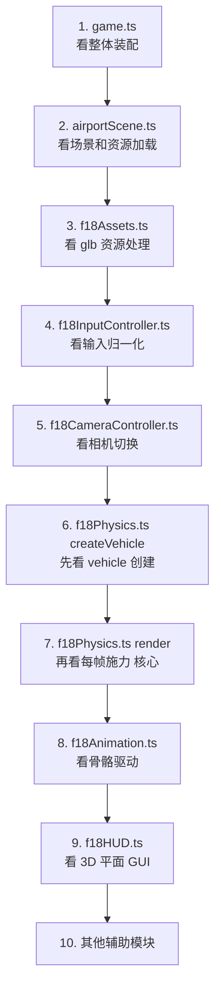

**学习技巧**：
- 在 `f18Physics.render()` 的每个 `applyForce` 前加 `console.log`，动手改数值（比如把推力系数 18 改成 36）再运行，直观感受参数
- 把 `stats.angularAcceleration` 的 `Math.PI * 0.3` 改成 `Math.PI * 0.6`，看看飞机操纵是否变灵敏
- 把 `flyLift` 分段函数的 2000 改成 500，看看会不会掉下来

### 阶段 5：做你自己的变体（2 周+）

不要想着"复现一个完全一样的"，而是：

1. **Level 1 作业**：换一架飞机模型（比如 Su-27），关键是维持 Blender 骨骼命名约定（见 Doc5 5.4）
2. **Level 2 作业**：加武器系统 —— 按空格发射一枚小球弹，用 `applyImpulse` 沿机头方向
3. **Level 3 作业**：加 AI 敌机 —— 在 `F18Physics` 基础上写一个每帧自动设置 `flyGamePadData` 的类
4. **Level 4 作业**：把 `btRaycastVehicle` 替换成**纯自定义物理体**，自己实现着陆轮（这是真正的飞机物理该有的样子）

## 6.3 本项目代码中值得背下来的精华片段

### 片段 1：Ammo 刚体的创建"三件套"

```typescript
// 几乎所有 Ammo 刚体都是这 3 步
const transform = new Ammo.btTransform();
transform.setIdentity();
transform.setOrigin(new Ammo.btVector3(x, y, z));
transform.setRotation(new Ammo.btQuaternion(qx, qy, qz, qw));

const motionState = new Ammo.btDefaultMotionState(transform);
const localInertia = new Ammo.btVector3(0, 0, 0);
shape.calculateLocalInertia(mass, localInertia);

const body = new Ammo.btRigidBody(
    new Ammo.btRigidBodyConstructionInfo(mass, motionState, shape, localInertia)
);
physicsWorld.addRigidBody(body);
```

### 片段 2：把 Babylon Mesh 和 Ammo Body 双向同步

```typescript
// Ammo → Babylon（每帧）
const tm = body.getWorldTransform(); // 或 vehicle.getChassisWorldTransform()
const p = tm.getOrigin(), q = tm.getRotation();
mesh.position.set(p.x(), p.y(), p.z());
mesh.rotationQuaternion.set(q.x(), q.y(), q.z(), q.w());
```

### 片段 3：局部方向向量 → 世界力

```typescript
// 想沿机头方向推力：mesh.forward 是机头朝向的世界坐标单位向量
body.applyForce(
    new Ammo.btVector3(
        -mesh.forward.x * thrust,
        -mesh.forward.y * thrust,
        -mesh.forward.z * thrust
    ),
    new Ammo.btVector3(0, 0, 0)  // 作用点 = 质心
);
// 注意：glb 模型机头朝 -Z，所以用 -forward
```

### 片段 4：帧率无关的平滑过渡

```typescript
const fpsDt = scene.getAnimationRatio();  // 约等于 60/当前FPS
const lerpSpeed = Math.min(0.2 * fpsDt, 0.99);
currentValue = Lerp(currentValue, targetValue, lerpSpeed);
```

## 6.4 ❓ 待确认的疑点（学习时要自己验证）

- `f18Physics.ts` L84-L99 的 yaw 力互相抵消：两次 `applyForce` 的方向相反、大小相同，推测是作者调试遗留。建议你跑代码时把其中一段注释掉看看差异。
- `f18Global.ts` 的 `lightClear` 是**模块级全局变量**，用来防止信号灯 interval 重复注册。但多架飞机共享这个灯光材质 —— 如果未来要让不同飞机灯光独立，这里要重构。
- 整个项目**没有测试**。学习完成后可以尝试给 `F18InputController.keyToAction` 写单测作为入门练习。

## 6.5 ⚠️ 遇到问题的排查清单

| 现象 | 可能原因 | 排查 |
|------|---------|-----|
| 白屏，控制台 `Ammo is not defined` | CDN 挂了 | 把 ammo.js 下载到本地放 `src/assets/` |
| 飞机生成后立刻坠地 | 升力不够 或 质量太大 | 检查 `massVehicle` 和 `flyLift` 分段 |
| 飞机无法抬头 | `flySpeed < 40` | 先加油门跑到 40km/h 再拉杆 |
| 按 R 起落架无反应 | 1500ms 冷却中 | 等一会儿再按，或者改 `undercarriageTime` 判断 |
| HUD 不显示 | 视角不是 fps | 按 V 切换视角 |
| 手柄按了没反应 | 浏览器策略 | 先按任意键盘激活 gamepad API |
| 模型导出后骨骼错乱 | Blender 导出时没勾选 "Apply Modifiers"/Skinning | 检查 `f18/` 源文件导出参数 |

## 6.6 延伸阅读地图

- Babylon.js 官方文档的这几个必读章节：`Physics`、`AssetContainer`、`Skeletons`、`GUI`、`TrailMesh`、`SpriteManager`
- Bullet3（Ammo 的 C++ 原版）的 `examples/VehicleDemo` —— 本项目车辆物理的祖宗
- 真实飞行动力学入门书《Aircraft Control and Simulation》Stevens & Lewis —— 如果你想把本项目的简化物理做成真家伙

---

## 总结：这个项目到底"巧"在哪？

1. **用车辆类做飞机**：`btRaycastVehicle` + 轮胎半径开关 = 既能地面滑跑又能起飞  
2. **复合刚体近似外形**：4 个 box 拼机身，既足够精确又极其便宜  
3. **输入三路归一化**：键盘/手柄/鼠标统一写入 `flyGamePadData`，物理层完全解耦  
4. **分段物理常数**：升力、阻力、角速度衰减分段常数，手感 > 真实  
5. **骨骼 + 物理双轨驱动**：轮胎用物理，副翼/方向舵用骨骼 Lerp，各司其职  
6. **约定即契约**：用 mesh 命名前缀做功能绑定，让 Blender 美术直接"编程"  

把这 6 点吃透，你就掌握了这类 3D 飞行游戏的核心套路。祝学得开心。
