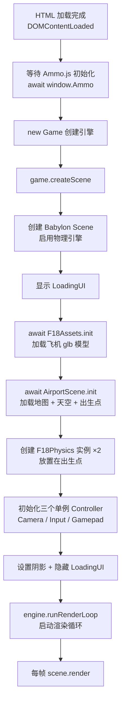

# Phase B-01 · 入口与场景装配

> 对应模块：`src/index.ts` + `src/game.ts`  
> 核心问题：游戏是怎么从一个 HTML 页面启动的？各个系统是按什么顺序组装起来的？

---

## 这个模块做什么（自然语言）

想象你在组装一架真实的飞机：你需要先把发动机（物理引擎）装好，再装机身（场景），再装仪表盘（HUD），最后才能起飞。`index.ts` 和 `game.ts` 就是这个「组装车间」——它们按正确的顺序把所有系统装配在一起，确保每个系统在需要它的系统之前就绪。

---

## 核心逻辑流程



---

## 源码实现

### index.ts —— 两行核心

```typescript
// 来源：src/index.ts
import 'babylonjs-loaders';  // 注册 GLTFFileLoader（必须在最前面 import）
import { Game } from './game';

window.addEventListener('DOMContentLoaded', async () => {
    // 关键步骤 1：等待 Ammo.js wasm 编译完成
    // Ammo.js 是 C++ 编译成的 WebAssembly，需要异步初始化
    await window["Ammo"]()

    // 关键步骤 2：创建游戏实例并启动场景
    let game = new Game('renderCanvas');
    game.createScene();
});
```

> ⚡ 为什么 `import 'babylonjs-loaders'` 要放在最前面？  
> 这行代码的副作用是「注册 GLTFFileLoader 插件到 Babylon 的加载器系统」。如果不 import，后面 `SceneLoader.LoadAssetContainer` 加载 `.glb` 文件时会报「找不到加载器」的错误。

### game.ts —— 装配顺序的关键

```typescript
// 来源：src/game.ts（精简版，保留关键逻辑）
export class Game {
    private _canvas: HTMLCanvasElement;
    private _engine: any;
    private scene: BABYLON.Scene
    private flyList = []
    private flyMesh;
    private airportScene: AirportScene;

    constructor(canvasElement: string) {
        // 步骤 1：获取 canvas 元素
        this._canvas = <HTMLCanvasElement>document.getElementById(canvasElement);
        // 步骤 2：创建 Babylon 渲染引擎（绑定到 canvas）
        this._engine = new BABYLON.Engine(this._canvas, true);
        // 注意：此时还没有 Scene，Scene 在 createScene() 里创建
    }

    async createScene() {
        // 步骤 3：创建场景
        this.scene = new BABYLON.Scene(this._engine);

        // 步骤 4：启用物理引擎（重力向下 -10）
        // 必须在创建任何物理对象之前调用！
        this.scene.enablePhysics(
            new BABYLON.Vector3(0, -10, 0),
            new AmmoJSPlugin(true, Ammo)  // Ammo 是全局变量（CDN 加载的）
        );

        // 步骤 5：创建临时相机（后面会被 F18CameraController 替换）
        let camera = new BABYLON.FreeCamera("camera1", new BABYLON.Vector3(0, 5, -10), this.scene);
        camera.setTarget(BABYLON.Vector3.Zero());
        camera.attachControl(this._canvas, true);

        // 步骤 6：创建方向光
        let dir = new BABYLON.Vector3(0.3, -1, 0.3);
        let light = new BABYLON.DirectionalLight("DirectionalLight", dir, this.scene);

        // 步骤 7：显示加载界面
        this._engine.displayLoadingUI();

        // 步骤 8：加载 F18 模型资源（异步，等待完成）
        let f18FighterAssets = new F18Assets(this._engine, this.scene)
        await f18FighterAssets.init()
        this.flyMesh = f18FighterAssets;

        // 步骤 9：创建机场场景（异步，等待完成）
        this.airportScene = new AirportScene(this.scene, this._engine)
        await this.airportScene.init()

        // 步骤 10：创建飞机物理实例（放置在地图预设的出生点）
        this.flyList[0] = new F18Physics(this._canvas, this._engine, this.scene, this.flyMesh)
        this.flyList[0].init(
            this.airportScene.flyPositions[0].absolutePosition.clone(),
            this.airportScene.flyPositions[0].absoluteRotationQuaternion.clone(),
        )
        // 同样方式创建第二架飞机...

        // 步骤 11：初始化三个单例控制器
        F18CameraController.ins.init(this._canvas, this.scene, this._engine)
        F18InputController.ins.init(this.scene)
        F18GamepadController.ins.init(this.scene)

        // 步骤 12：设置控制目标（默认驾驶第一架飞机）
        F18CameraController.ins.tergetVehicle(this.flyList[0])
        F18InputController.ins.tergetVehicle(this.flyList[0])

        // 步骤 13：设置级联阴影
        this.shadow = new BABYLON.CascadedShadowGenerator(1024, light);
        light.intensity = 2.5;
        for (let mesh of this.scene.meshes) {
            if (mesh.name != "skySphere") {
                this.shadow.getShadowMap().renderList.push(mesh);
                mesh.receiveShadows = true;
                mesh.isPickable = false;
            }
        }

        // 步骤 14：隐藏加载界面，启动渲染循环
        this._engine.hideLoadingUI();
        this._engine.runRenderLoop(() => {
            this.scene.render();
            document.getElementById("showFps").innerHTML = `fps:${this._engine.getFps().toFixed()}`
        });

        // 步骤 15：监听窗口大小变化
        window.addEventListener("resize", () => { this._engine.resize(); });
    }
}
```

---

## 关键设计意图

### 为什么 Ammo 要在最外层 await？

```typescript
// index.ts
await window["Ammo"]()  // ← 必须在 new Game() 之前
let game = new Game('renderCanvas');
```

Ammo.js 是 WebAssembly 模块，编译需要时间。如果在 `new Game()` 之后才初始化 Ammo，而 `Game` 构造函数里就用到了 Ammo（比如 `new AmmoJSPlugin`），会报「Ammo is not defined」。

### 为什么 flyMesh 要在 airportScene 之前加载？

```typescript
await f18FighterAssets.init()   // 先加载飞机
await this.airportScene.init()  // 再加载地图
// 然后才能创建飞机实例
this.flyList[0] = new F18Physics(..., this.flyMesh)
```

`F18Physics` 构造函数需要 `flyMesh`（已加载的模型容器），所以模型必须先加载完。地图加载完才能知道出生点位置（`airportScene.flyPositions`），所以地图也必须先加载完。

### 出生点是怎么来的？

```typescript
// 来源：src/physicsScene/airportScene.ts init 方法
for (let mesh of this.assetContainer.meshes) {
    // 地图 glb 里有名为 "flymesh_0"、"flymesh_1" 的空网格
    // 它们的位置和旋转就是飞机的出生点
    if (mesh.name.indexOf("flymesh") != -1) {
        this.flyPositions[mesh.name.split("_")[1]] = mesh;
        mesh.parent = null
        mesh.setEnabled(false)  // 隐藏这个标记网格
    }
}
```

出生点不是硬编码的坐标，而是**在 Blender 里放置的空物体**，导出到 glb 后被代码识别。这让美术可以直接在 Blender 里调整出生点位置，不需要改代码。

---

## 动手练习

在 Phase C 的练习 1 中，你将实现这个最小版本：

```typescript
// 目标：一个有物理引擎的空场景
async function main() {
    await window["Ammo"]();
    
    const canvas = document.getElementById('canvas') as HTMLCanvasElement;
    const engine = new BABYLON.Engine(canvas, true);
    const scene = new BABYLON.Scene(engine);
    
    scene.enablePhysics(new BABYLON.Vector3(0, -10, 0), new AmmoJSPlugin(true, Ammo));
    
    const camera = new BABYLON.FreeCamera("cam", new BABYLON.Vector3(0, 5, -10), scene);
    camera.setTarget(BABYLON.Vector3.Zero());
    camera.attachControl(canvas, true);
    
    new BABYLON.HemisphericLight("light", new BABYLON.Vector3(0, 1, 0), scene);
    
    engine.runRenderLoop(() => scene.render());
    window.addEventListener("resize", () => engine.resize());
}
```

**下一篇**：[02-输入归一化系统.md](./02-输入归一化系统.md)
