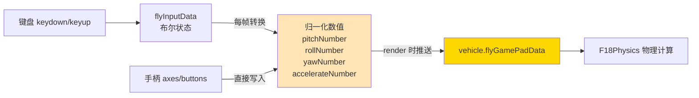

# Phase B-02 · 输入归一化系统

> 对应模块：`f18InputController.ts` + `f18GamePadController.ts`  
> 核心问题：键盘按下/松开（布尔值）和手柄摇杆（-1~1 的浮点数）是完全不同的输入，飞机物理层怎么统一处理？

---

## 这个模块做什么（自然语言）

想象一个翻译官：无论你用中文、英文还是手语说「向左转」，翻译官都把它转换成同一个标准信号传给飞行员。`F18InputController` 就是这个翻译官——键盘的「A 键按下」和手柄的「左摇杆推到 -0.8」，最终都被翻译成 `rollNumber = -0.8`，飞机物理层只认这个标准信号。

---

## 核心逻辑流程



---

## 源码实现

### 第一层：键盘事件 → 布尔状态

```typescript
// 来源：src/vehicleObject/f18/f18InputController.ts

// 键盘输入的原始状态（布尔值）
public flyInputData: FlyInputData = {
    pitchUp: false,
    pitchDown: false,
    rollLeft: false,
    rollRight: false,
    yawLeft: false,
    yawRight: false,
    accelerate: false,
    brake: false
}

// 键盘事件 → 更新布尔状态
private keyToAction(code, state: boolean) {
    if (!this.vehicle) { return }

    switch (code) {
        case "KeyW": this.flyInputData.pitchDown = state; break;  // W = 低头
        case "KeyS": this.flyInputData.pitchUp   = state; break;  // S = 抬头
        case "KeyA": this.flyInputData.rollLeft  = state; break;  // A = 左滚
        case "KeyD": this.flyInputData.rollRight = state; break;  // D = 右滚
        case "KeyQ": this.flyInputData.yawLeft   = state; break;  // Q = 左偏航
        case "KeyE": this.flyInputData.yawRight  = state; break;  // E = 右偏航
        case "ShiftLeft": this.flyInputData.accelerate = state; break;  // Shift = 加速
        case "Space":     this.flyInputData.brake      = state; break;  // Space = 刹车
        // 视角切换和起落架：只在松开时触发（!state 防止长按重复触发）
        case "KeyV": !state && F18CameraController.ins.cameraChange(); break;
        case "KeyR": !state && this.vehicle.undercarriageChange(); break;
    }
}
```

> ⚡ 注意 `!state &&` 这个技巧：`keydown` 时 `state=true`，`keyup` 时 `state=false`。`!state` 在 keyup 时为 true，所以视角切换只在松开键时触发一次，不会因为长按而连续切换。

### 第二层：布尔状态 → 归一化数值（每帧）

```typescript
// 来源：src/vehicleObject/f18/f18InputController.ts

// 归一化后的数值（这才是物理层真正使用的）
public pitchNumber = 0      // [-1, 1]
public rollNumber = 0       // [-1, 1]
public yawNumber = 0        // [-1, 1]
public accelerateNumber = 0 // [0, 1000]
public brakeNumber = 0      // 0 or 1

// 每帧执行的 render 方法
private render() {
    // 更新手柄状态显示
    document.getElementById("gamepadState").innerHTML =
        this.gamePadState ? "手柄状态:on" : "手柄状态:off"

    // 关键：手柄连接时跳过键盘转换（手柄直接写入数值）
    if (!this.gamePadState) {
        this.updateYawNumber()
        this.updateRollNumber()
        this.updatePitchNumber()
        this.updateAccelerateNumberAndBrakeNumber()
    }

    // 把归一化数值推送给飞机
    this.vehicle.flyGamePadData.yawNumber      = this.yawNumber
    this.vehicle.flyGamePadData.rollNumber     = this.rollNumber
    this.vehicle.flyGamePadData.pitchNumber    = this.pitchNumber
    this.vehicle.flyGamePadData.accelerateNumber = this.accelerateNumber
    this.vehicle.flyGamePadData.brakeNumber    = this.brakeNumber
}

// 俯仰转换：布尔 → -1/0/1
private updatePitchNumber() {
    if (this.flyInputData.pitchDown) {
        this.pitchNumber = -1
    } else if (this.flyInputData.pitchUp) {
        this.pitchNumber = 1
    } else {
        this.pitchNumber = 0
    }
}

// 油门转换：布尔 → 累积数值（0~1000，每帧 ±5）
private updateAccelerateNumberAndBrakeNumber() {
    if (this.flyInputData.accelerate) {
        if (this.accelerateNumber >= 1000) {
            this.accelerateNumber = 1000  // 上限
        } else {
            this.accelerateNumber += 5    // 每帧增加 5
        }
        this.brakeNumber = 0
    } else if (this.flyInputData.brake) {
        if (this.accelerateNumber <= 0) {
            this.accelerateNumber = 0     // 下限
        } else {
            this.accelerateNumber -= 5    // 每帧减少 5
        }
        this.brakeNumber = 1
    } else {
        this.brakeNumber = 0
    }
}
```

> ⚡ 油门设计的精妙之处：俯仰/翻滚/偏航是「按住 = 持续」（松开立刻归零），但油门是「按住 = 累积」（松开后保持当前值）。这模拟了真实飞机的油门手柄——你不需要一直按着 Shift 才能保持速度。

### 第三层：手柄直接写入数值

```typescript
// 来源：src/vehicleObject/f18/f18GamePadController.ts

private render() {
    this.gamepads = navigator.getGamepads();
    for (let gamepad of this.gamepads) {
        if (gamepad) {
            F18InputController.ins.gamePadState = true
            this.gamepad = gamepad

            // 手柄直接写入 F18InputController 的数值属性
            this.updateYawNumber()
            this.updateRollNumber()
            this.updatePitchNumber()
            this.updateAccelerateNumberAndBrakeNumber()
            this.updateFpsCameraRotation()
            this.updateOtherButton()
        }
    }
    // 没有手柄时重置状态
    if (this.gamepads.every((item) => { return item == null })) {
        F18InputController.ins.gamePadState = false
    }
}

// 手柄俯仰：右摇杆 Y 轴（axis[3]），有死区处理
private updatePitchNumber() {
    if (this.gamepad.axes[3] && Math.abs(this.gamepad.axes[3]) > 0.1) {
        F18InputController.ins.pitchNumber = this.gamepad.axes[3]
        // 手柄是模拟量，直接赋值（-1~1 的浮点数）
    } else {
        F18InputController.ins.pitchNumber = 0
        // 死区处理：摇杆不完全居中时（<0.1）视为 0，防止漂移
    }
}

// 手柄偏航：LT/RT 扳机（buttons[6]/[7]）
private updateYawNumber() {
    if (this.gamepad.buttons[6].touched) {
        F18InputController.ins.yawNumber = -this.gamepad.buttons[6].value
    }
    if (this.gamepad.buttons[7].touched) {
        F18InputController.ins.yawNumber = this.gamepad.buttons[7].value
    }
    if (!this.gamepad.buttons[6].touched && !this.gamepad.buttons[7].touched) {
        F18InputController.ins.yawNumber = 0
    }
}

// 手柄震动反馈（Xbox/PS4 支持）
public vibrationActuator(duration, weakMagnitude, strongMagnitude) {
    this.gamepad &&
        this.gamepad.vibrationActuator &&
        this.gamepad.vibrationActuator.playEffect("dual-rumble", {
            startDelay: 0,
            duration: duration,
            weakMagnitude: weakMagnitude,
            strongMagnitude: strongMagnitude
        });
}
```

---

## 设计意图：为什么要三层分离？

```
层 1（flyInputData）：记录「用户在做什么」（按了哪个键）
层 2（pitchNumber 等）：记录「飞机应该怎么动」（归一化的控制信号）
层 3（flyGamePadData）：飞机物理层的输入接口

好处：
- 物理层完全不知道输入来自键盘还是手柄
- 未来加入触屏控制，只需要写入层 2 的数值，不需要改物理层
- 键盘和手柄可以无缝切换（gamePadState 标志）
```

---

## 键盘 vs 手柄的数值差异

| 控制 | 键盘输出 | 手柄输出 | 差异 |
|------|---------|---------|------|
| 俯仰 | -1 或 0 或 1（离散） | -1.0 ~ 1.0（连续） | 手柄更精细 |
| 翻滚 | -1 或 0 或 1（离散） | -1.0 ~ 1.0（连续） | 手柄更精细 |
| 偏航 | -1 或 0 或 1（离散） | 0 ~ 1.0（扳机，连续） | 手柄更精细 |
| 油门 | 累积 0~1000（渐变） | 累积 0~1000（渐变） | 相同 |

---

## 动手练习

在 Phase C 练习 4 中，你将实现一个最小的输入控制器：

```typescript
// 目标：键盘控制一个立方体移动
class SimpleInputController {
    private static instance: SimpleInputController;
    public static get ins() {
        if (!this.instance) this.instance = new SimpleInputController();
        return this.instance;
    }

    public moveX = 0;
    public moveZ = 0;

    private _keydown;
    private _keyup;
    private keys = { left: false, right: false, up: false, down: false };

    public init(scene: BABYLON.Scene) {
        window.addEventListener('keydown', this._keydown = (e) => {
            if (e.code === 'ArrowLeft')  this.keys.left  = true;
            if (e.code === 'ArrowRight') this.keys.right = true;
            if (e.code === 'ArrowUp')    this.keys.up    = true;
            if (e.code === 'ArrowDown')  this.keys.down  = true;
        });
        window.addEventListener('keyup', this._keyup = (e) => {
            if (e.code === 'ArrowLeft')  this.keys.left  = false;
            if (e.code === 'ArrowRight') this.keys.right = false;
            if (e.code === 'ArrowUp')    this.keys.up    = false;
            if (e.code === 'ArrowDown')  this.keys.down  = false;
        });
        scene.onBeforeRenderObservable.add(() => {
            this.moveX = this.keys.right ? 1 : this.keys.left ? -1 : 0;
            this.moveZ = this.keys.up    ? 1 : this.keys.down ? -1 : 0;
        });
    }
}
```

**下一篇**：[03-物理飞控核心.md](./03-物理飞控核心.md)（最重要的一篇）
