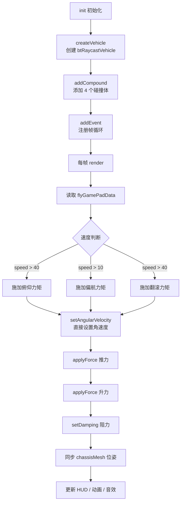

# Phase B-03 · 物理飞控核心 ★

> 对应模块：`src/vehicleObject/f18/f18Physics.ts`  
> 核心问题：一架飞机的物理体是怎么创建的？推力/升力/阻力/俯仰/翻滚/偏航是怎么用 Ammo.js 实现的？  
> ⚠️ 这是整个项目最复杂的模块，建议先完成 Phase A 全部内容再读这篇。

---

## 这个模块做什么（自然语言）

想象你在玩一个遥控飞机：飞机本体是一个有重量的盒子（刚体），下面挂着 4 个轮子（起落架），发动机在屁股后面推（推力），机翼产生向上的力（升力），空气阻力让它减速（阻力），拨动摇杆时飞机会转头（力矩）。`F18Physics` 就是这个遥控飞机的「物理大脑」——它每帧计算这些力，告诉 Ammo 物理引擎「这帧飞机应该受到什么力」，然后 Ammo 算出新的位置和姿态。

---

## 核心逻辑流程



---

## 源码实现

### 第一步：创建物理载具（createVehicle）

```typescript
// 来源：src/vehicleObject/f18/f18Physics.ts createVehicle 方法

private createVehicle() {
    // ① 获取 Ammo 物理世界（Babylon 封装了它，需要这样取出来）
    let physicsWorld = this.scene.getPhysicsEngine().getPhysicsPlugin().world;

    // ② 创建机身碰撞形状（一个简单的盒子）
    // 注意：这只是主碰撞体，翼展等复杂形状用 addCompound 追加
    let geometry = new Ammo.btBoxShape(
        new Ammo.btVector3(
            this.chassisWidth * .5,   // 2 * 0.5 = 1（半宽）
            this.chassisHeight * .5,  // 0.6 * 0.5 = 0.3（半高）
            this.chassisLength * .5   // 8 * 0.5 = 4（半长）
        )
    );

    // ③ 设置初始位置和旋转
    let transform = new Ammo.btTransform();
    transform.setIdentity();
    transform.setOrigin(new Ammo.btVector3(
        this.position.x, this.position.y, this.position.z
    ));
    transform.setRotation(new Ammo.btQuaternion(
        this.quaternion.x, this.quaternion.y,
        this.quaternion.z, this.quaternion.w
    ));

    // ④ 创建运动状态（Ammo 用它追踪物体的位置）
    let motionState = new Ammo.btDefaultMotionState(transform);

    // ⑤ 计算局部惯性（影响旋转的阻力）
    let localInertia = new Ammo.btVector3(0, 0, 0);
    geometry.calculateLocalInertia(this.massVehicle, localInertia);
    // massVehicle = 200（飞机质量 200kg，比真实 F18 轻很多，为了游戏手感）

    // ⑥ 创建 Babylon 可见网格（透明盒子，作为飞机模型的父节点）
    this.chassisMesh = this.createChassisMesh(
        this.chassisWidth, this.chassisHeight, this.chassisLength
    );

    // ⑦ 质量偏移（让重心稍微偏上，增加稳定性）
    let massOffset = new Ammo.btVector3(0, 0.4, 0);
    let transform2 = new Ammo.btTransform();
    transform2.setIdentity();
    transform2.setOrigin(massOffset);

    // ⑧ 创建复合形状（主体 + 后续 addCompound 追加的翼展等）
    this.compound = new Ammo.btCompoundShape();
    this.compound.addChildShape(transform2, geometry);

    // ⑨ 创建刚体
    this.vehicleBody = new Ammo.btRigidBody(
        new Ammo.btRigidBodyConstructionInfo(
            this.massVehicle, motionState, this.compound, localInertia
        )
    );
    this.vehicleBody.setActivationState(4);  // 4 = DISABLE_DEACTIVATION（永不休眠）
    physicsWorld.addRigidBody(this.vehicleBody);

    // ⑩ 创建车辆调谐参数
    let tuning = new Ammo.btVehicleTuning();
    let rayCaster = new Ammo.btDefaultVehicleRaycaster(physicsWorld);

    // ⑪ 创建 btRaycastVehicle（核心！）
    this.vehicle = new Ammo.btRaycastVehicle(tuning, this.vehicleBody, rayCaster);
    this.vehicle.setCoordinateSystem(0, 1, 2);  // X=右, Y=上, Z=前
    physicsWorld.addAction(this.vehicle);

    // ⑫ 添加 4 个轮子（起落架）
    let addWheel = (isFront, pos, radius, width, index) => {
        let wheelInfo = this.vehicle.addWheel(
            pos,                          // 轮子相对机身的位置
            this.wheelDirectionCS0,       // 悬挂方向（向下 0,-1,0）
            this.wheelAxleCS,             // 轮轴方向（向左 -1,0,0）
            this.suspensionRestLength,    // 悬挂静止长度 0.6
            radius,
            tuning,
            isFront
        );
        wheelInfo.set_m_suspensionStiffness(this.suspensionStiffness);    // 悬挂刚度 18
        wheelInfo.set_m_wheelsDampingRelaxation(this.suspensionDamping);  // 阻尼 0.3
        wheelInfo.set_m_wheelsDampingCompression(this.suspensionCompression); // 压缩 4.4
        wheelInfo.set_m_maxSuspensionForce(600000);  // 最大悬挂力
        wheelInfo.set_m_frictionSlip(10);            // 摩擦力（高 = 不打滑）
        wheelInfo.set_m_rollInfluence(this.rollInfluence);  // 翻滚影响 0.1

        this.wheelMeshes[index] = this.createWheelMesh(radius, width);
    }

    // 前轮（居中，模拟前三点式起落架）
    addWheel(true,  new Ammo.btVector3(0,    0.05, 2.12),  0.181, 0.3, 0);  // 前左
    addWheel(true,  new Ammo.btVector3(0,    0.05, 2.12),  0.181, 0.3, 1);  // 前右（同位置）
    // 后轮（左右分开）
    addWheel(false, new Ammo.btVector3(-1.13, 0.05, -1.32), 0.212, 0.3, 2); // 后左
    addWheel(false, new Ammo.btVector3(1.13,  0.05, -1.32), 0.212, 0.3, 3); // 后右

    this.vehicleReady = true;
}
```

### 第二步：添加复合碰撞体（addCompound）

```typescript
// 来源：src/vehicleObject/f18/f18Physics.ts init 方法
// 在 createVehicle 之后调用，追加翼展等碰撞体

// 翅膀（宽 6.8，高 0.3，深 2，位于机身中部）
this.addCompound(
    { x: 6.8, y: 0.3, z: 2 },   // 碰撞盒尺寸
    { x: 0, y: 0.6, z: -1.2 },  // 相对机身的偏移
    BABYLON.Quaternion.RotationAxis(new BABYLON.Vector3(0, 1, 0), 0)
)

// 尾翼（水平尾翼）
this.addCompound({ x: 4.2, y: 0.2, z: 2 }, { x: 0, y: 0.6, z: -4.2 }, ...)

// 垂尾（垂直尾翼）
this.addCompound({ x: 2.2, y: 0.8, z: 0.8 }, { x: 0, y: 1.8, z: -3.6 }, ...)

// 机身（主体）
this.addCompound({ x: 1, y: 0.8, z: 9 }, { x: 0, y: 0.8, z: 0 }, ...)
```

复合体的作用：让飞机的碰撞形状更接近真实外形，翼展会和地面/障碍物碰撞，而不是只有机身中心的小盒子。

### 第三步：每帧物理计算（render）

```typescript
// 来源：src/vehicleObject/f18/f18Physics.ts render 方法（核心！）

public render(): void {
    if (!this.chassisMesh) { return }

    let fpsDt: any = this.scene.getAnimationRatio()  // 帧率无关系数

    if (this.vehicleReady) {
        // ① 获取当前速度（km/h）
        this.flyData.flySpeed = this.vehicle.getCurrentSpeedKmHour();

        // ② 获取机身姿态（用于 HUD 显示）
        const _rotation = new BABYLON.Quaternion();
        const _position = new BABYLON.Vector3();
        this.chassisMesh.getWorldMatrix().decompose(null, _rotation, _position);
        let flyRotation = _rotation.toEulerAngles()

        // ③ 更新 HUD 姿态数据
        this.f18HUDController.setPitch(flyRotation.x / (Math.PI * 2))
        this.f18HUDController.setRoll(-flyRotation.z - Math.PI)
        this.f18HUDController.setYaw(flyRotation.y / (Math.PI * 2))

        // ④ 俯仰力（速度 > 40 才有效，模拟低速无法拉杆）
        if (this.flyData.flySpeed > 40) {
            this.vehicleBody.applyForce(
                new Ammo.btVector3(
                    -this.chassisMesh.up.x * 18 * this.flyGamePadData.pitchNumber * this.flyData.accelerateSize * fpsDt,
                    -this.chassisMesh.up.y * 18 * this.flyGamePadData.pitchNumber * this.flyData.accelerateSize * fpsDt,
                    -this.chassisMesh.up.z * 18 * this.flyGamePadData.pitchNumber * this.flyData.accelerateSize * fpsDt
                ),
                new Ammo.btVector3(0, 0, 0)
            );
            // 解读：沿机身 up 方向施加力，pitchNumber 决定方向（正/负）
            // 乘以 accelerateSize：速度越快，俯仰力越大（模拟气动效果）
        }

        // ⑤ 偏航力（速度 > 10 才有效）
        // ⚠️ 注意：这里有两段方向相反的力，互相抵消，是历史遗留代码
        if (this.flyData.flySpeed > 10) {
            this.vehicleBody.applyForce(
                new Ammo.btVector3(
                    -this.chassisMesh.right.x * 18 * this.flyGamePadData.yawNumber * ...,
                    ...
                ), new Ammo.btVector3(0, 0, 0)
            );
        }
        // 下面还有一段 +right 方向的力，与上面抵消
        // 实际偏航效果主要靠 setAngularVelocity（见下面）

        // ⑥ 刹车
        if (this.flyGamePadData.brakeNumber == 1) {
            this.vehicle.setBrake(10 / 2 * fpsDt, this.FRONT_LEFT);
            this.vehicle.setBrake(10 / 2 * fpsDt, this.FRONT_RIGHT);
            this.vehicle.setBrake(10 * fpsDt, this.BACK_LEFT);
            this.vehicle.setBrake(10 * fpsDt, this.BACK_RIGHT);
        } else {
            this.vehicle.setBrake(0, ...);  // 松刹车
        }

        // ⑦ 同步轮胎位置（从 Ammo 读取，写入 Babylon Mesh）
        let n = this.vehicle.getNumWheels();
        for (let i = 0; i < n; i++) {
            this.vehicle.updateWheelTransform(i, true);
            let tm = this.vehicle.getWheelTransformWS(i);
            let p = tm.getOrigin(), q = tm.getRotation();
            this.wheelMeshes[i].position.set(p.x(), p.y(), p.z());
            this.wheelMeshes[i].rotationQuaternion.set(q.x(), q.y(), q.z(), q.w());
            this.wheelMeshes[i].rotate(BABYLON.Axis.Z, Math.PI / 2);
        }

        // ⑧ 同步机身位置（从 Ammo 读取，写入 Babylon Mesh）
        let tm = this.vehicle.getChassisWorldTransform();
        let p = tm.getOrigin(), q = tm.getRotation();
        this.chassisMesh.position.set(p.x(), p.y(), p.z());
        this.chassisMesh.rotationQuaternion.set(q.x(), q.y(), q.z(), q.w());
        this.chassisMesh.rotate(BABYLON.Axis.X, Math.PI);  // 修正模型朝向
    }

    // ⑨ 推力（沿机头方向，不依赖速度判断）
    let _speed2 = 18 * this.flyData.accelerateSize;  // 最大推力 = 18 * 1000 = 18000
    this.vehicleBody.applyForce(
        new Ammo.btVector3(
            -this.chassisMesh.forward.x * _speed2 * fpsDt,
            -this.chassisMesh.forward.y * _speed2 * fpsDt,
            -this.chassisMesh.forward.z * _speed2 * fpsDt
        ),
        new Ammo.btVector3(0, 0, 0)
    );
    // 注意：-forward 是因为 glb 模型机头朝 -Z 方向

    // ⑩ 角速度控制（俯仰/翻滚/偏航的核心实现）
    let globalAngularSpeeds = this.vehicleBody.getAngularVelocity()
    let YawPitchRollIn = new BABYLON.Vector3(0, 0, 0)

    if (this.flyData.flySpeed > 40) YawPitchRollIn.x = -2 * this.flyGamePadData.pitchNumber
    if (this.flyData.flySpeed > 10) YawPitchRollIn.y = 0.8 * this.flyGamePadData.yawNumber
    if (this.flyData.flySpeed > 40) YawPitchRollIn.z = 4 * this.flyGamePadData.rollNumber

    // 乘以角加速度系数
    YawPitchRollIn = new BABYLON.Vector3(
        YawPitchRollIn.x * Math.PI * 0.3,
        YawPitchRollIn.y * Math.PI * 0.3,
        YawPitchRollIn.z * Math.PI * 0.3
    )

    // 从局部坐标转换到世界坐标（关键！）
    let matr = new BABYLON.Matrix();
    this.chassisMesh.rotationQuaternion.toRotationMatrix(matr)
    YawPitchRollIn = BABYLON.Vector3.TransformCoordinates(YawPitchRollIn, matr);

    // 与当前角速度插值（平滑过渡）
    let lerp2 = (0.05 * fpsDt) >= 0.99 ? 0.99 : (0.05 * fpsDt)
    let newYPR = BABYLON.Vector3.Lerp(
        new BABYLON.Vector3(
            globalAngularSpeeds.x(),
            globalAngularSpeeds.y(),
            globalAngularSpeeds.z()
        ),
        YawPitchRollIn,
        lerp2
    )
    // 应用角速度衰减（0.95 = 每帧保留 95% 的角速度）
    newYPR.multiplyInPlace(new BABYLON.Vector3(0.95, 0.95, 0.95))
    // 直接设置角速度（不是施加力矩！）
    this.vehicleBody.setAngularVelocity(new Ammo.btVector3(newYPR.x, newYPR.y, newYPR.z))

    // ⑪ 升力（分段函数）
    if (this.flyData.flySpeed > 300)      this.flyData.flyLift = 2000
    else if (this.flyData.flySpeed > 150) this.flyData.flyLift = 500
    else                                   this.flyData.flyLift = this.flyData.flySpeed
    this.vehicleBody.applyForce(
        new Ammo.btVector3(0, this.flyData.flyLift * fpsDt, 0),
        new Ammo.btVector3(0, 0, 0)
    );

    // ⑫ 阻力（分段函数）
    if (this.flyData.flySpeed > 300)      this.flyData.resistance = 0.7
    else if (this.flyData.flySpeed > 150) this.flyData.resistance = 0.5
    else                                   this.flyData.resistance = 0.2
    this.vehicleBody.setDamping(this.flyData.resistance, 0);
}
```

---

## 关键物理概念图解

### 飞机坐标系

```
        up (Y+)
        ↑
        |
        |___→ right (X+)
       /
      ↙ forward (Z-)  ← 机头朝 -Z，所以推力用 -forward
```

### 力的作用点

```
applyForce(force, point)
  point = (0,0,0) → 作用在质心，只产生线速度，不产生力矩
  point ≠ (0,0,0) → 作用在偏离质心的点，同时产生线速度和力矩
```

本项目所有 `applyForce` 都作用在质心（`new Ammo.btVector3(0,0,0)`），力矩通过 `setAngularVelocity` 直接设置，而不是通过偏心力产生。

### 为什么用 setAngularVelocity 而不是 applyTorque？

```
applyTorque（真实物理）：
  施加力矩 → 角加速度 → 角速度逐渐增加 → 有惯性
  优点：真实，有惯性感
  缺点：难以精确控制，可能失控

setAngularVelocity（本项目）：
  直接设置角速度 → 立刻生效
  优点：响应快，手感好，容易调参
  缺点：不真实，没有惯性感
```

---

## 物理参数速查表

| 参数 | 值 | 含义 | 调大效果 |
|------|-----|------|---------|
| `massVehicle` | 200 | 飞机质量 kg | 更难加速，升力更难抬起 |
| `suspensionStiffness` | 18 | 悬挂刚度 | 起落架更硬，弹跳更剧烈 |
| `suspensionRestLength` | 0.6 | 悬挂静止长度 | 起落架更长 |
| `rollInfluence` | 0.1 | 翻滚影响 | 转弯时更容易侧翻 |
| `angularAcceleration` | π×0.3 | 角加速度 | 转向更灵敏 |
| `angularDeceleration` | 0.95 | 角速度保留率 | 更接近 1 = 转向惯性更大 |
| 推力系数 | 18 | 每单位油门的推力 | 加速更快 |
| 升力上限 | 2000 | 高速时的升力 N | 更容易飞上去 |

**下一篇**：[04-场景与资源加载.md](./04-场景与资源加载.md)
