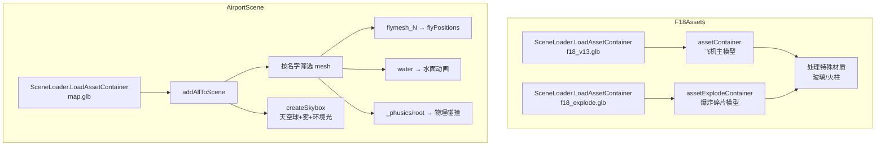

# Phase B-04 · 场景与资源加载

> 对应模块：`src/physicsScene/airportScene.ts` + `src/vehicleObject/f18/f18Assets.ts`  
> 核心问题：3D 模型是怎么加载的？地图、天空、水面、出生点是怎么实现的？

---

## 这个模块做什么（自然语言）

想象你在布置一个舞台：`F18Assets` 负责把演员（飞机模型）准备好放在后台，`AirportScene` 负责搭建舞台（地图、天空、水面）并标记好演员的出场位置（出生点）。两者都用「异步加载」——就像网购，下单后继续做别的事，货到了再处理。

---

## 核心逻辑流程



---

## 源码实现

### F18Assets —— 模型加载与材质处理

```typescript
// 来源：src/vehicleObject/f18/f18Assets.ts

export class F18Assets {
    public assetContainer: BABYLON.AssetContainer;        // 飞机主模型容器
    public assetExplodeContainer: BABYLON.AssetContainer; // 爆炸碎片容器

    public async init() {
        // 并行加载两个模型（注意：项目里是串行的，这里展示更优的写法）
        this.assetContainer = await this.loadFly(this.engine, this.scene);
        this.assetExplodeContainer = await this.loadFlyExplode(this.engine, this.scene);

        // 加载雨滴视频纹理（用于飞机玻璃的折射效果）
        this.videoTexture = new BABYLON.VideoTexture(
            "video",
            url + "assets/video/rain4.mp4",
            this.scene,
            true  // 自动播放
        );
        this.videoTexture.uScale = 2;
        this.videoTexture.vScale = 2;
        this.videoTexture.getAlphaFromRGB = true;  // 用 RGB 亮度作为透明度

        // 遍历所有网格，处理特殊材质
        for (let mesh of this.assetContainer.meshes) {
            // 玻璃材质（座舱盖）：添加雨滴折射效果
            if (mesh.name.indexOf("boli") != -1 || mesh.name.indexOf("0853") != -1) {
                mesh.material["bumpTexture"] = this.videoTexture      // 法线贴图 = 雨滴视频
                mesh.material["albedoColor"] = new BABYLON.Color3(1, 1, 1)
                mesh.material["albedoTexture"] = null                 // 去掉原始贴图
                mesh.material["opacityTexture"] = this.videoTexture;  // 透明度 = 雨滴视频
                mesh.material["subSurface"].isRefractionEnabled = true; // 开启折射
                mesh.material["subSurface"].indexOfRefraction = 1;
                mesh.material["bumpTexture"].level = 0.4
            }

            // 火柱材质（发动机尾焰）：半透明发光
            if (mesh.name.indexOf("火柱") != -1) {
                mesh.material["albedoTexture"].hasAlpha = true
                mesh.material["specularColor"] = new BABYLON.Color3(0, 0, 0);
                mesh.material.alpha = 0.7
                mesh["disableLighting"] = true;  // 不受光照影响（自发光）
            }
        }
    }

    // 把回调式 API 包装成 Promise（见 Phase A-03）
    private loadFly(engine, scene: BABYLON.Scene): any {
        return new Promise((success) => {
            BABYLON.SceneLoader.LoadAssetContainer(
                url + "assets/mesh/flymesh/",  // 目录
                "f18_v13.glb",                 // 文件名
                scene,
                async (container) => {
                    success(container)  // 加载完成，resolve
                }
            );
        })
    }
}
```

### AssetContainer 的关键特性

```typescript
// AssetContainer 是「资源仓库」，不直接显示在场景中
// 需要用 instantiateModelsToScene() 创建实例才会显示

// 来源：src/vehicleObject/f18/f18Physics.ts 构造函数
constructor(_canvas, _engine, scene, flyMesh) {
    // flyMesh 是 F18Assets 实例
    // instantiateModelsToScene() 从容器里克隆出一套完整的模型
    this.flyMesh = flyMesh.assetContainer.instantiateModelsToScene();
    this.flyMeshExplode = flyMesh.assetExplodeContainer.instantiateModelsToScene();
    // 每次调用都创建独立的实例，所以多架飞机共享同一个 AssetContainer
    // 但各自有独立的网格实例（位置、旋转互不影响）
}
```

> ⚡ 核心洞察：`AssetContainer` + `instantiateModelsToScene()` 是 Babylon 实现「多实例共享资源」的标准方式。加载一次，实例化多次，节省内存和加载时间。

### AirportScene —— 地图、天空、水面

```typescript
// 来源：src/physicsScene/airportScene.ts

export class AirportScene {
    public flyPositions = []  // 飞机出生点数组

    async init() {
        this.addEvent()           // 注册帧循环（水面动画）
        this.createSkybox(this.scene)  // 创建天空球

        // 加载地图 glb
        this.assetContainer = await this.loadMap(this._engine, this.scene);
        this.assetContainer.addAllToScene()  // 把所有网格加入场景

        // 遍历所有网格，按命名约定分类处理
        for (let mesh of this.assetContainer.meshes) {
            // 约定 1：名字含 "flymesh" 的是飞机出生点标记
            if (mesh.name.indexOf("flymesh") != -1) {
                // "flymesh_0" → flyPositions[0]
                // "flymesh_1" → flyPositions[1]
                this.flyPositions[mesh.name.split("_")[1]] = mesh;
                mesh.parent = null
                mesh.setEnabled(false)  // 隐藏标记网格（不显示在场景中）
            }
        }

        for (let mesh of this.assetContainer.meshes) {
            // 约定 2：名字含 "water" 的是水面
            if (mesh.name.indexOf("water") != -1) {
                this.waterMesh = mesh
            }

            // 约定 3：名字含 "_phusics" 或 "root" 的需要物理碰撞
            // 注意：_phusics 是拼写错误（应该是 _physics），但代码里就是这样
            if (mesh.name.indexOf("_phusics") != -1 || mesh.name.indexOf("root") != -1) {
                mesh.physicsImpostor = new BABYLON.PhysicsImpostor(
                    mesh,
                    BABYLON.PhysicsImpostor.MeshImpostor,  // 精确网格碰撞
                    { mass: 0 }  // mass=0 = 静态物体（不会被推动）
                );
            }
        }
    }

    private createSkybox(scene) {
        // 天空球（不是天空盒！用球体 + 内面渲染）
        let skyboxMaterial = new BABYLON.StandardMaterial("skyBox", scene);
        skyboxMaterial.backFaceCulling = false;  // 关闭背面剔除（从内部看球体）
        skyboxMaterial.diffuseTexture = new BABYLON.Texture(url + "assets/texture/skybox6.png", scene);
        skyboxMaterial.emissiveTexture = new BABYLON.Texture(url + "assets/texture/skybox6.png", scene);
        skyboxMaterial.specularColor = new BABYLON.Color3(0, 0, 0);  // 无高光
        skyboxMaterial.disableLighting = true;  // 不受光照影响

        this.skySphere = BABYLON.MeshBuilder.CreateSphere("skySphere", { diameter: 15000 }, scene);
        this.skySphere.rotation.x = Math.PI;  // 翻转（贴图方向修正）
        this.skySphere.position.y = 100;
        this.skySphere.scaling.y = 0.5;       // 压扁（天空不是正球形）
        this.skySphere.material = skyboxMaterial
        this.skySphere.applyFog = false;       // 天空不受雾影响

        // 环境贴图（用于 PBR 材质的反射/折射）
        scene.environmentTexture = new BABYLON.CubeTexture(
            url + "assets/texture/skybox6/skybox6", scene
        );
        scene.environmentTexture.level = 1;

        // 指数雾（远处变灰，增加深度感）
        scene.fogMode = BABYLON.Scene.FOGMODE_EXP;
        scene.fogDensity = 0.00005;
        scene.fogColor = new BABYLON.Color3(0.2, 0.2, 0.2);

        // 辉光层（让发光材质更亮）
        this.gl = new BABYLON.GlowLayer("glow", scene);
        this.gl.intensity = 1;
    }

    // 水面动画：每帧偏移 UV，产生流动效果
    private render() {
        if (this.waterMesh) {
            this.waterMesh.material["bumpTexture"].uOffset += 0.001
        }
    }
}
```

---

## 命名约定是真正的数据契约

这是本项目最重要的「隐性规则」：

```
Blender 里的命名 → 代码里的行为

flymesh_0    → flyPositions[0]（第一个出生点）
flymesh_1    → flyPositions[1]（第二个出生点）
water        → 水面 UV 动画
_phusics     → 物理碰撞体（注意拼写错误！）
root         → 物理碰撞体
boli         → 玻璃材质（雨滴折射）
0853         → 玻璃材质（另一个命名）
火柱         → 尾焰材质（半透明）
LOD_DO_1~5  → LOD 距离分级
```

> ⚠️ 如果你要替换地图模型，必须在 Blender 里保持这些命名约定，否则代码无法识别出生点和碰撞体。

---

## 资源加载的完整时序

```
1. F18Assets.loadFly()        → 下载 f18_v13.glb（约 5-10MB）
2. F18Assets.loadFlyExplode() → 下载 f18_explode.glb（约 2-3MB）
3. F18Assets 处理材质          → 设置玻璃/火柱特效
4. AirportScene.loadMap()     → 下载 map.glb（约 10-20MB）
5. AirportScene 分类网格       → 识别出生点/水面/碰撞体
6. AirportScene.createSkybox() → 创建天空球、雾、辉光
7. 创建 F18Physics 实例        → 从 AssetContainer 实例化模型
```

**下一篇**：[05-相机与视角切换.md](./05-相机与视角切换.md)
