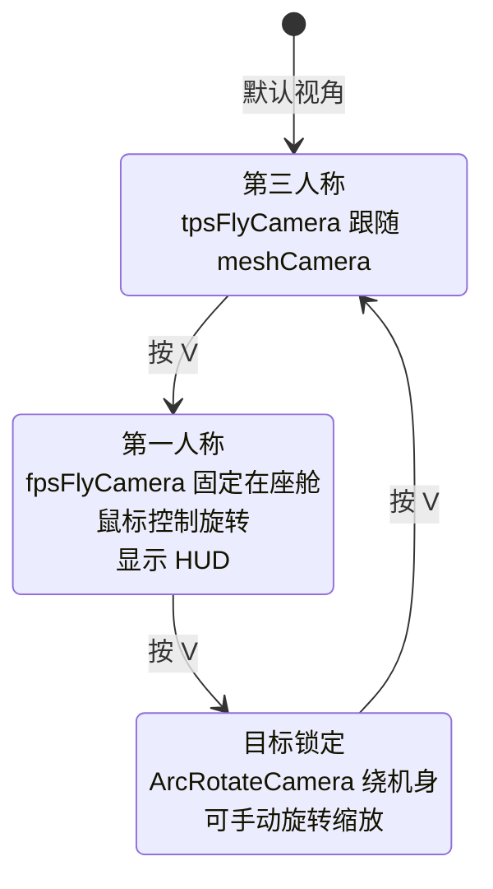

# Phase B-05 · 相机与视角切换

> 对应模块：`src/vehicleObject/f18/f18CameraController.ts`  
> 核心问题：三种视角（第三人称/第一人称/目标锁定）是怎么实现的？相机如何平滑跟随飞机？

---

## 这个模块做什么（自然语言）

想象一个电影摄影师：他有三台摄像机——一台跟在飞机屁股后面（第三人称），一台装在座舱里（第一人称），一台可以绕着飞机转（目标锁定）。按 V 键就是让导演喊「切换机位」。`F18CameraController` 就是这个导演，管理三台摄像机的切换和跟随逻辑。

---

## 三种相机的对比

| 视角 | 相机类型 | 特点 | HUD |
|------|---------|------|-----|
| `tps`（第三人称） | `UniversalCamera` | 跟在飞机后方，Lerp 平滑跟随 | 隐藏 |
| `fps`（第一人称） | `UniversalCamera` | 固定在座舱内，鼠标控制视角 | 显示 |
| `target`（目标锁定） | `ArcRotateCamera` | 绕飞机旋转，可缩放 | 隐藏 |

---

## 核心逻辑流程



---

## 源码实现

### 相机创建

```typescript
// 来源：src/vehicleObject/f18/f18CameraController.ts create 方法

private create(): void {
    // ① 第一人称相机（座舱内）
    this.fpsFlyCamera = new BABYLON.UniversalCamera(
        "UniversalCamera",
        new BABYLON.Vector3(0, -1.30, -2.35),  // 相对机身的偏移（座舱位置）
        this.scene
    );
    this.fpsFlyCamera.minZ = 0;       // 近裁剪面 = 0（防止座舱内部被裁掉）
    this.fpsFlyCamera.maxZ = 20000;   // 远裁剪面（能看到很远）
    this.fpsFlyCamera.fov = 1.2;      // 视野角（弧度，约 69°）

    // ② 第三人称相机（跟随用的「目标点」）
    // 注意：tpsFlyCamera 不直接 parent 到飞机，而是每帧 Lerp 到 meshCamera 的位置
    this.tpsFlyCamera = new BABYLON.UniversalCamera(
        "UniversalCamera",
        new BABYLON.Vector3(0, -1.9, 12.3),  // 初始位置（飞机后方）
        this.scene
    );

    // ③ 跟随锚点（不可见的小盒子，parent 到飞机上）
    // tpsFlyCamera 每帧 Lerp 到这个锚点的世界坐标
    this.meshCamera = BABYLON.MeshBuilder.CreateBox(
        "meshCamera", { width: 0, depth: 0, height: 0 }, this.scene
    );
    this.meshCamera.position = new BABYLON.Vector3(0, -3.5, 12.3);  // 飞机后上方
    this.meshCamera.visibility = 0;  // 不可见

    // ④ 目标锁定相机（ArcRotateCamera 可以绕目标旋转）
    this.targetCamera = new BABYLON.ArcRotateCamera(
        "Camera", 0, 0, 10,
        new BABYLON.Vector3(0, 0, 0),  // 初始目标点
        this.scene
    );
    this.targetCamera.upperRadiusLimit = 30;  // 最远距离
    this.targetCamera.lowerRadiusLimit = 10;  // 最近距离
    // 降低鼠标灵敏度（默认太灵敏）
    this.targetCamera.angularSensibilityX = 10000;
    this.targetCamera.angularSensibilityY = 10000;

    // ⑤ 小地图相机（正交投影，固定在左下角）
    this.lookAtCamera = new BABYLON.UniversalCamera(
        "UniversalCamera",
        new BABYLON.Vector3(100, 300, 100),
        this.scene
    );
    this.lookAtCamera.mode = BABYLON.Camera.ORTHOGRAPHIC_CAMERA;  // 正交投影
    this.lookAtCamera.viewport = new BABYLON.Viewport(0, 0.3, 0.2, 0.2);  // 左下角 20%×20%
    // 设置正交投影范围
    let zoom = 10;
    this.lookAtCamera.orthoTop = zoom;
    this.lookAtCamera.orthoBottom = -zoom;
    // ...
}
```

### 切换目标飞机

```typescript
// 来源：src/vehicleObject/f18/f18CameraController.ts

public tergetVehicle(vehicle: F18Physics) {
    // 关闭上一架飞机的 HUD
    this.vehicle ? this.vehicle.showHud = false : "";

    this.vehicle = vehicle

    // 把 fps 相机和锚点 parent 到新飞机的机身网格
    this.fpsFlyCamera.parent = this.vehicle.chassisMesh
    this.meshCamera.parent = this.vehicle.chassisMesh;

    // 目标锁定相机的目标设为新飞机
    this.targetCamera.setTarget(this.vehicle.chassisMesh);

    // 重置视角旋转
    this.fpsFlyCamera.rotation = new BABYLON.Vector3(-Math.PI * 1, Math.PI * 0, Math.PI * 2)
    this.moveX = 0;
    this.moveY = 0;
}
```

> ⚡ 关键设计：`fpsFlyCamera.parent = chassisMesh` 让第一人称相机自动跟随飞机（Babylon 的父子关系会自动传递变换）。但 `tpsFlyCamera` 不用 parent，而是每帧 Lerp，这样有平滑的跟随延迟感。

### 每帧渲染（相机跟随 + 视角切换）

```typescript
// 来源：src/vehicleObject/f18/f18CameraController.ts render 方法

public render() {
    if (!this.vehicle) { return }

    let fpsDt: any = this.scene.getAnimationRatio()
    let lerp1 = (0.4 * fpsDt) >= 0.99 ? 0.99 : (0.4 * fpsDt)  // 位置插值速度
    let lerp2 = (0.2 * fpsDt) >= 0.99 ? 0.99 : (0.2 * fpsDt)  // 旋转插值速度

    // 根据当前视角激活对应相机
    if (this.flyViews[this.flyViewIndex] == "tps") {
        this.vehicle.showHud = false;
        this.scene.activeCameras = [this.tpsFlyCamera];  // 激活第三人称相机
        this.targetCamera.detachControl(this.canvas);    // 禁用目标相机的鼠标控制
    } else if (this.flyViews[this.flyViewIndex] == "fps") {
        this.vehicle.showHud = true;
        this.scene.activeCameras = [this.fpsFlyCamera];
        this.targetCamera.detachControl(this.canvas);
    } else if (this.flyViews[this.flyViewIndex] == "target") {
        this.vehicle.showHud = false;
        this.scene.activeCameras = [this.targetCamera];
        this.targetCamera.attachControl(this.canvas, true);  // 启用鼠标控制
    }

    // 第三人称相机：平滑跟随锚点
    this.tpsFlyCamera.position = BABYLON.Vector3.Lerp(
        this.tpsFlyCamera.position,           // 当前位置
        this.meshCamera.absolutePosition,     // 目标位置（锚点的世界坐标）
        lerp1                                 // 插值系数（越大跟随越快）
    );

    // 第三人称相机：平滑旋转（Slerp 用于四元数插值）
    if (!this.tpsFlyCamera.rotationQuaternion) {
        this.tpsFlyCamera.rotationQuaternion = this.meshCamera.absoluteRotationQuaternion;
    }
    this.tpsFlyCamera.rotationQuaternion = BABYLON.Quaternion.Slerp(
        this.tpsFlyCamera.rotationQuaternion,
        this.meshCamera.absoluteRotationQuaternion,
        lerp2
    );

    // 第一人称相机：根据鼠标移动量计算旋转
    // moveX/moveY 是鼠标累积移动量（在 rotate3D 里更新）
    let YawPitchRollInBeigin = this.vehicle.YawPitchRollInBeigin;  // 飞机姿态偏移
    this.fpsFlyCamera.rotation = new BABYLON.Vector3(
        (this.moveY / 1000 - Math.PI * 1) + (YawPitchRollInBeigin.x * 0.02),
        -this.moveX / 1000 + Math.PI * 0,
        YawPitchRollInBeigin.z * 0.02 + Math.PI * 2
    )
    // moveY/1000：鼠标上下移动 → 俯仰视角
    // moveX/1000：鼠标左右移动 → 偏航视角
    // YawPitchRollInBeigin * 0.02：飞机姿态轻微影响视角（增加沉浸感）

    // 小地图相机：始终看向飞机
    this.vehicle.chassisMesh && this.lookAtCamera.setTarget(this.vehicle.chassisMesh.position);

    // 更新 Web Audio 监听器位置（3D 音效需要知道"耳朵"在哪里）
    BABYLON.Engine.audioEngine.audioContext.listener.setPosition(
        this.scene.activeCameras[0].globalPosition.x,
        this.scene.activeCameras[0].globalPosition.y,
        this.scene.activeCameras[0].globalPosition.z
    );
}
```

### 鼠标旋转（第一人称视角）

```typescript
// 来源：src/vehicleObject/f18/f18CameraController.ts

private rotate3D(event) {
    // 只在第一人称视角时响应鼠标
    if (this.flyViews[this.flyViewIndex] != "fps") { return }

    this.movementX = event.movementX;  // 这帧鼠标水平移动量
    this.movementY = event.movementY;  // 这帧鼠标垂直移动量

    // 累积移动量
    var _moveX = this.moveX + event.movementX;
    var _moveY = this.moveY + event.movementY;

    // 限制旋转范围（防止视角翻转）
    let xRotationMax = 1800, xRotationMin = -1800;
    let yRotationMax = 1000, yRotationMin = -1000;

    this.moveX = Math.max(xRotationMin, Math.min(xRotationMax, _moveX));
    this.moveY = Math.max(yRotationMin, Math.min(yRotationMax, _moveY));
}
```

---

## Lerp vs Slerp 的选择

```typescript
// 位置插值：用 Vector3.Lerp（线性插值）
this.tpsFlyCamera.position = BABYLON.Vector3.Lerp(current, target, t);

// 旋转插值：用 Quaternion.Slerp（球面线性插值）
this.tpsFlyCamera.rotationQuaternion = BABYLON.Quaternion.Slerp(current, target, t);
```

为什么旋转要用 Slerp 而不是 Lerp？
- 旋转用四元数表示，四元数的「直线插值」会导致旋转速度不均匀（在某些角度快，某些角度慢）
- Slerp（球面线性插值）沿球面弧线插值，旋转速度均匀，视觉效果更自然

---

## 音频监听器位置更新

```typescript
// 每帧更新 Web Audio API 的监听器位置
// 这让 3D 音效知道「耳朵」在哪里，从而计算左右声道和距离衰减
BABYLON.Engine.audioEngine.audioContext.listener.setPosition(
    this.scene.activeCameras[0].globalPosition.x,
    this.scene.activeCameras[0].globalPosition.y,
    this.scene.activeCameras[0].globalPosition.z
);
```

这是 3D 音效系统的关键：音源（飞机引擎）固定在飞机上，监听器（耳朵）跟随相机移动，Web Audio API 自动计算距离衰减和方向感。

**下一篇**：[06-骨骼动画驱动.md](./06-骨骼动画驱动.md)
