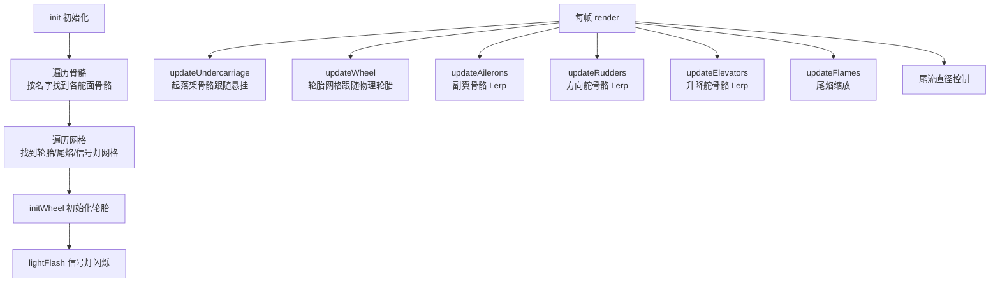

# Phase B-06 · 骨骼动画驱动

> 对应模块：`src/vehicleObject/f18/f18Animation.ts`  
> 核心问题：副翼、方向舵、升降舵、起落架是怎么随操纵输入实时偏转的？

---

## 这个模块做什么（自然语言）

想象一个木偶师：飞机模型里有一套「骨骼」（就像木偶的关节），`F18Animation` 就是木偶师，每帧根据飞行员的操纵输入（pitchNumber/rollNumber/yawNumber）拉动对应的骨骼，让副翼、方向舵、升降舵偏转到正确角度。同时，它还负责起落架的收放动画、尾焰的缩放、信号灯的闪烁。

---

## 飞机气动舵面说明

```
副翼（Aileron）：机翼后缘，控制翻滚（Roll）
  左副翼上偏 + 右副翼下偏 → 向左翻滚

方向舵（Rudder）：垂直尾翼，控制偏航（Yaw）
  方向舵向左偏 → 机头向左转

升降舵（Elevator）：水平尾翼，控制俯仰（Pitch）
  升降舵上偏 → 机头抬起
```

---

## 核心逻辑流程



---

## 源码实现

### 初始化：按名字找骨骼

```typescript
// 来源：src/vehicleObject/f18/f18Animation.ts init 方法

public init() {
    // 停止所有动画组（起落架动画默认停在收起状态）
    this.vehicle.flyMesh.animationGroups.map((item) => {
        item.loopAnimation = false;
        item.start(false, 3, item.to, item.from, false);  // 反向播放到终点（收起状态）
    })

    // 从骨骼 0（起落架骨骼）中找到各骨骼
    for (let bone of this.vehicle.skeletons[0].bones) {
        if (bone.name.indexOf("k4_qlik") != -1)    { this.bones[0] = bone }  // 前轮
        if (bone.name.indexOf("后轮液压左") != -1)  { this.bones[3] = bone }  // 后轮左液压
        if (bone.name.indexOf("后轮液压右") != -1)  { this.bones[2] = bone }  // 后轮右液压
    }

    // 从骨骼 1（机身骨骼）中找到各舵面骨骼
    for (let bone of this.vehicle.skeletons[1].bones) {
        if (bone.name.indexOf("副翼右") != -1)  { this.ailerons[0] = bone }
        if (bone.name.indexOf("副翼左") != -1)  { this.ailerons[1] = bone }
        if (bone.name.indexOf("方向舵右") != -1) { this.rudders[0] = bone }
        if (bone.name.indexOf("方向舵左") != -1) { this.rudders[1] = bone }
        if (bone.name.indexOf("升降舵") != -1)   { this.elevators[0] = bone }
    }

    // 找到轮胎网格（用于和物理轮胎同步位置）
    this.vehicle.flyMesh.rootNodes[0].getChildMeshes(false, (mesh) => {
        if (mesh.name.indexOf("前轮子_LOD_DO_3") != -1)    { this.ikMeshes[0] = mesh }
        if (mesh.name.indexOf("后轮左_LOD_DO_3") != -1)    { this.ikMeshes[3] = mesh }
        if (mesh.name.indexOf("后轮右_LOD_DO_3") != -1)    { this.ikMeshes[2] = mesh }
        // 克隆轮胎（克隆版跟随物理，原版跟随骨骼）
        if (mesh.name.indexOf("前轮子子轮_LOD_DO_3") != -1) {
            this.ikMeshesClone[0] = mesh.clone()
            mesh.visibility = 0;  // 隐藏原版
        }
        // ... 后轮类似
        if (mesh.name.indexOf("火柱.001") != -1) { this.flames[0] = mesh; }
        if (mesh.name.indexOf("火柱.002") != -1) { this.flames[1] = mesh; }
    })
}
```

### 升降舵更新（最简单的舵面）

```typescript
// 来源：src/vehicleObject/f18/f18Animation.ts

private updateElevators() {
    let fpsDt: any = this.scene.getAnimationRatio()
    let lerp2 = (0.2 * fpsDt) >= 0.99 ? 0.99 : (0.2 * fpsDt)

    // 升降舵骨骼旋转 Lerp 到目标角度
    // pitchNumber ∈ [-1, 1]，乘以 0.25 限制最大偏转角
    this.elevators[0].getTransformNode().rotation = BABYLON.Vector3.Lerp(
        this.elevators[0].getTransformNode().rotation,  // 当前旋转
        new BABYLON.Vector3(
            this.vehicle.flyGamePadData.pitchNumber * 0.25,  // 目标 X 轴旋转
            0,
            0
        ),
        lerp2  // 平滑插值
    );
}
```

### 副翼更新（差动偏转）

```typescript
// 来源：src/vehicleObject/f18/f18Animation.ts

private updateAilerons() {
    // 预定义三个关键角度（通过 Blender 调试得出的真实骨骼旋转值）
    let down_1 = new BABYLON.Vector3(-0.089, -0.3, -1.519)   // 右副翼下偏
    let center_1 = new BABYLON.Vector3(-0.089, -0.089, -1.519) // 右副翼中立
    let up_1 = new BABYLON.Vector3(-0.089, 0.3, -1.519)      // 右副翼上偏

    let down_2 = new BABYLON.Vector3(0.046, -0.3, 1.476)     // 左副翼下偏
    let center_2 = new BABYLON.Vector3(0.046, -0.089, 1.476) // 左副翼中立
    let up_2 = new BABYLON.Vector3(0.046, 0.3, 1.476)        // 左副翼上偏

    let fpsDt: any = this.scene.getAnimationRatio()
    let lerp2 = (0.2 * fpsDt) >= 0.99 ? 0.99 : (0.2 * fpsDt)

    if (this.vehicle.flyGamePadData.rollNumber > 0) {
        // 向右翻滚：右副翼上偏，左副翼下偏（差动）
        this.ailerons[0].getTransformNode().rotation = BABYLON.Vector3.Lerp(
            this.ailerons[0].getTransformNode().rotation,
            new BABYLON.Vector3(
                center_1.x + (up_1.x - center_1.x) * this.vehicle.flyGamePadData.rollNumber,
                center_1.y + (up_1.y - center_1.y) * this.vehicle.flyGamePadData.rollNumber,
                center_1.z + (up_1.z - center_1.z) * this.vehicle.flyGamePadData.rollNumber
            ),
            lerp2
        )
        // 左副翼同理，方向相反...
    } else if (this.vehicle.flyGamePadData.rollNumber < 0) {
        // 向左翻滚：右副翼下偏，左副翼上偏
        // ...
    } else {
        // 回中：两侧副翼回到中立位置
        this.ailerons[0].getTransformNode().rotation = BABYLON.Vector3.Lerp(
            this.ailerons[0].getTransformNode().rotation, center_1, lerp2
        );
        this.ailerons[1].getTransformNode().rotation = BABYLON.Vector3.Lerp(
            this.ailerons[1].getTransformNode().rotation, center_2, lerp2
        );
    }
}
```

> ⚡ 关键技巧：`center + (up - center) * rollNumber` 是一个线性插值公式：
> - `rollNumber = 0` → 结果 = center（中立）
> - `rollNumber = 1` → 结果 = up（最大上偏）
> - `rollNumber = 0.5` → 结果 = center 和 up 的中点

### 起落架收放

```typescript
// 来源：src/vehicleObject/f18/f18Animation.ts

public undercarriageChange() {
    // 防抖：1500ms 内不能重复切换
    if (Date.now() - this.undercarriageTime > 1500) {
        this.undercarriageTime = Date.now()
    } else {
        return
    }

    this.vehicle.undercarriageState = !this.vehicle.undercarriageState

    // 播放起落架动画（animationGroups[0] 是起落架动画）
    this.flyAn = this.vehicle.flyMesh.animationGroups[0];
    if (this.vehicle.undercarriageState) {
        // 收起 → 放下：反向播放动画
        this.flyAn.start(false, 3, this.flyAn.to, this.flyAn.from, false);
    } else {
        // 放下 → 收起：正向播放动画
        this.flyAn.start(false, 3, this.flyAn.from, this.flyAn.to, false);
    }

    // 收起时：立刻显示骨骼驱动的轮胎（动画过程中可见）
    if (!this.vehicle.undercarriageState) {
        this.ikMeshes[0].visibility = 1;   // 显示骨骼轮胎
        this.ikMeshesClone[0].visibility = 0;  // 隐藏物理轮胎
        // ...
    }

    // 1000ms 后（动画播完）：切换到物理驱动的轮胎
    setTimeout(() => {
        if (this.vehicle.undercarriageState) {
            this.ikMeshes[0].visibility = 0;   // 隐藏骨骼轮胎
            this.ikMeshesClone[0].visibility = 1;  // 显示物理轮胎
            // ...
        }
    }, 1000);
}
```

### 起落架的双轨驱动

这是本项目最精妙的设计之一：

```
起落架放下时（地面滑行）：
  轮胎位置 = 物理引擎计算（btRaycastVehicle 的悬挂）
  ikMeshesClone（克隆轮胎）跟随 wheelMeshes（物理轮胎）
  骨骼液压杆跟随悬挂长度变化

起落架收起时（飞行中）：
  轮胎位置 = 骨骼动画控制
  ikMeshes（原始轮胎）跟随骨骼
  物理轮胎半径设为 0.001（实际上不接触地面）
```

```typescript
// 来源：src/vehicleObject/f18/f18Animation.ts updateUndercarriage

private updateUndercarriage() {
    if (this.undercarriageState) {  // 起落架放下时
        // 读取物理引擎的悬挂长度，驱动骨骼液压杆
        let y_2 = -this.vehicle.vehicle.getWheelInfo(2).get_m_raycastInfo().get_m_suspensionLength() * 2
        this.axises[2] = new BABYLON.Vector3(1.735 + y_2, -0.294, 0.114);
        this.bones[2].getTransformNode().rotation = this.axises[2]
        // 悬挂压缩时 y_2 变小，骨骼旋转角度变化，液压杆视觉上缩短
    }
}
```

---

## 信号灯闪烁

```typescript
// 来源：src/vehicleObject/f18/f18Animation.ts lightFlash

private lightFlash() {
    // 防止多架飞机重复注册（材质是共享的）
    if (lightClear) { return }

    // 每 1000ms 闪烁一次
    setLightClear(setInterval(() => {
        this.lightMeshes[0].material.emissiveTexture.level = 40  // 亮
        setTimeout(() => {
            this.lightMeshes[0].material.emissiveTexture.level = 0   // 灭
        }, 100)
    }, 1000))
}
```

> ⚠️ 注意：`lightClear` 是 `f18Global.ts` 里的模块级变量，用于跨实例共享 interval 句柄。这是因为多架飞机共享同一套灯光材质，只能有一个 interval 控制它。

**下一篇**：[07-HUD与音效爆炸.md](./07-HUD与音效爆炸.md)
